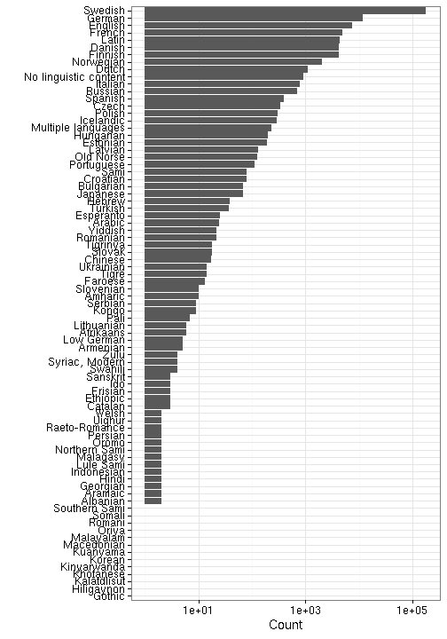

## Language

 * 97 unique languages
 * The languages may come in [combinations](output.tables/language_conversions.csv)
 * 275 docs (0.07%) with multiple languages
 * 124502 docs (32.27%) with no recognized language 
 * [Discarded languages](output.tables/language_discarded.csv)

Language codes are from [MARC](http://www.loc.gov/marc/languages/language_code.html); new custom abbreviations can be added in [this table](https://github.com/rOpenGov/bibliographica/blob/master/inst/extdata/language_abbreviations.csv).

Title count per language (including multi-language documents):

### Top languages

|Language | Documents (n)| Fraction (%)|
|:--------|-------------:|------------:|
|Swedish  |        210902|         80.8|
|German   |         12587|          4.8|
|English  |          7570|          2.9|
|Latin    |          7208|          2.8|
|French   |          5321|          2.0|
|Finnish  |          4421|          1.7|

