# Preprocessing summary

## Specific fields

  * [Author info](author.md)
  * [Gender info](gender.md)
  * [Publisher info](publisher.md)
  * [Publication geography](publicationplace.md)
  * [Publication year info](publicationyear.md)
  * [Titles](title.md)  
  * [Document sizes](size.md)
  * [Document and subject topics](topic.md)
  * [Languages](language.md)

## Field conversions

This documents the conversions from raw data to the final preprocessed version (accepted, discarded, conversions). Only some of the key tables are explicitly linked below. The complete list of all summary tables is [here](output.tables/).

## Annotated documents

Fraction of documents with data:

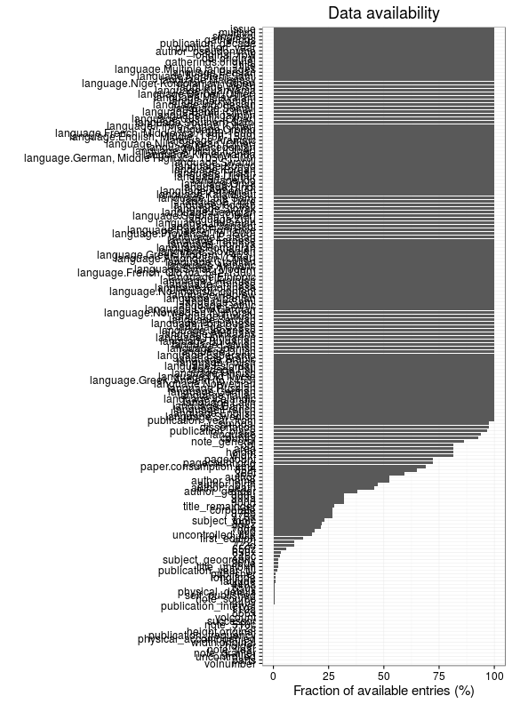

Same in exact numbers: documents with available/missing entries, and number of unique entries for each field. Sorted by missing data:

|field name                                   | missing (%)| available (%)| available (n)| unique (n)|
|:--------------------------------------------|-----------:|-------------:|-------------:|----------:|
|volnumber                                    |       100.0|           0.0|             0|          1|
|parts                                        |       100.0|           0.0|             1|          2|
|holder                                       |       100.0|           0.0|             1|          2|
|uncontrolled                                 |       100.0|           0.0|             3|          4|
|note_year                                    |       100.0|           0.0|             4|          5|
|note_granter                                 |       100.0|           0.0|             8|          8|
|note_510c                                    |       100.0|           0.0|            49|         47|
|width.original                               |        99.9|           0.1|           323|         52|
|note_source                                  |        99.8|           0.2|           729|        669|
|successor                                    |        99.7|           0.3|          1216|       1204|
|physical_accomppanied                        |        99.6|           0.4|          1306|        793|
|publication_frequency                        |        99.5|           0.5|          1861|        130|
|866x                                         |        99.4|           0.6|          2106|        237|
|volcount                                     |        99.4|           0.6|          2219|         40|
|772c                                         |        99.1|           0.9|          3415|       1023|
|publication_interval                         |        99.0|           1.0|          3643|       3201|
|650y                                         |        98.9|           1.1|          4051|        951|
|latitude                                     |        98.5|           1.5|          5654|         18|
|longitude                                    |        98.5|           1.5|          5654|         18|
|height.original                              |        98.2|           1.8|          6545|         88|
|subject_geography                            |        98.2|           1.8|          6550|       2207|
|650x                                         |        97.8|           2.2|          8261|       2099|
|110a                                         |        97.6|           2.4|          8766|       6316|
|title_uniform                                |        97.4|           2.6|          9732|       6055|
|publication_year_till                        |        97.0|           3.0|         10976|        353|
|772d                                         |        96.4|           3.6|         13425|       3153|
|772t                                         |        96.3|           3.7|         13582|       4337|
|650z                                         |        95.9|           4.1|         15171|       2624|
|260e                                         |        93.6|           6.4|         23662|        691|
|uncontrolled_title                           |        92.0|           8.0|         29527|      26244|
|corporate                                    |        91.8|           8.2|         30521|       5831|
|440v                                         |        91.0|           9.0|         33299|      10130|
|700d                                         |        89.6|          10.4|         38634|      11360|
|subject_topic                                |        88.7|          11.3|         42135|      21959|
|first_edition                                |        87.9|          12.1|         44943|          3|
|physical_details                             |        87.3|          12.7|         47127|        826|
|440a                                         |        85.4|          14.6|         54040|      24951|
|700a                                         |        83.9|          16.1|         59746|      32018|
|paper.consumption.km2                        |        83.8|          16.2|         60039|       3992|
|obl                                          |        82.4|          17.6|         65209|          3|
|260f                                         |        81.8|          18.2|         67446|       7008|
|width                                        |        80.7|          19.3|         71684|         63|
|height                                       |        80.7|          19.3|         71684|         91|
|area                                         |        80.7|          19.3|         71684|        192|
|245c                                         |        72.9|          27.1|        100485|      76457|
|976a                                         |        72.1|          27.9|        103718|      28933|
|976b                                         |        72.1|          27.9|        103718|      29654|
|900d                                         |        66.2|          33.8|        125629|      19499|
|note_general                                 |        65.3|          34.7|        128748|      78585|
|900a                                         |        65.1|          34.9|        129691|      24203|
|900u                                         |        65.1|          34.9|        129691|      23921|
|title_remainder                              |        55.9|          44.1|        163620|     129320|
|author_death                                 |        55.6|          44.4|        164933|        536|
|author_gender                                |        54.9|          45.1|        167394|          4|
|author_birth                                 |        51.8|          48.2|        179074|        575|
|pagecount.orig                               |        36.7|          63.3|        234891|       1419|
|pagecount                                    |        36.2|          63.8|        236910|       1419|
|852z                                         |        36.0|          64.0|        237529|      15285|
|language                                     |        31.8|          68.2|        253061|         99|
|author_name                                  |        26.0|          74.0|        274667|      86891|
|author                                       |        26.0|          74.0|        274667|      88146|
|country                                      |        10.4|          89.6|        332694|         37|
|852j                                         |         8.3|          91.7|        340640|     127373|
|dissertation                                 |         1.9|          98.1|        364409|          3|
|synodal                                      |         1.9|          98.1|        364409|          2|
|publication_place                            |         1.5|          98.5|        365928|       3279|
|publication_year_from                        |         0.0|         100.0|        371298|        523|
|title                                        |         0.0|         100.0|        371313|     326282|
|language.Swedish                             |         0.0|         100.0|        371321|          2|
|language.English                             |         0.0|         100.0|        371321|          2|
|language.French                              |         0.0|         100.0|        371321|          2|
|language.Danish                              |         0.0|         100.0|        371321|          2|
|language.Latin                               |         0.0|         100.0|        371321|          2|
|language.Icelandic                           |         0.0|         100.0|        371321|          2|
|language.Italian                             |         0.0|         100.0|        371321|          2|
|language.German                              |         0.0|         100.0|        371321|          2|
|language.Russian                             |         0.0|         100.0|        371321|          2|
|language.Norwegian                           |         0.0|         100.0|        371321|          2|
|language.Greek, Ancient (to 1453)            |         0.0|         100.0|        371321|          1|
|language.Old Norse                           |         0.0|         100.0|        371321|          2|
|language.Finnish                             |         0.0|         100.0|        371321|          2|
|language.Pali                                |         0.0|         100.0|        371321|          2|
|language.Estonian                            |         0.0|         100.0|        371321|          2|
|language.Polish                              |         0.0|         100.0|        371321|          2|
|language.Arabic                              |         0.0|         100.0|        371321|          2|
|language.Esperanto                           |         0.0|         100.0|        371321|          2|
|language.Dutch                               |         0.0|         100.0|        371321|          2|
|language.Spanish                             |         0.0|         100.0|        371321|          2|
|language.Latvian                             |         0.0|         100.0|        371321|          2|
|language.Bulgarian                           |         0.0|         100.0|        371321|          2|
|language.Hungarian                           |         0.0|         100.0|        371321|          2|
|language.Afrikaans                           |         0.0|         100.0|        371321|          2|
|language.Japanese                            |         0.0|         100.0|        371321|          2|
|language.Czech                               |         0.0|         100.0|        371321|          2|
|language.Portuguese                          |         0.0|         100.0|        371321|          2|
|language.Serbian                             |         0.0|         100.0|        371321|          2|
|language.Turkish                             |         0.0|         100.0|        371321|          2|
|language.Norwegian (Nynorsk)                 |         0.0|         100.0|        371321|          1|
|language.Low German                          |         0.0|         100.0|        371321|          2|
|language.Gothic                              |         0.0|         100.0|        371321|          2|
|language.Sami                                |         0.0|         100.0|        371321|          2|
|language.Albanian                            |         0.0|         100.0|        371321|          2|
|language.Hebrew                              |         0.0|         100.0|        371321|          2|
|language.No linguistic content               |         0.0|         100.0|        371321|          2|
|language.Khotanese                           |         0.0|         100.0|        371321|          2|
|language.Chinese                             |         0.0|         100.0|        371321|          2|
|language.Ukrainian                           |         0.0|         100.0|        371321|          2|
|language.Ethiopic                            |         0.0|         100.0|        371321|          2|
|language.French, Old (ca. 842-1300)          |         0.0|         100.0|        371321|          1|
|language.Syriac, Modern                      |         0.0|         100.0|        371321|          2|
|language.Amharic                             |         0.0|         100.0|        371321|          2|
|language.Croatian                            |         0.0|         100.0|        371321|          2|
|language.Algonquian (Other)                  |         0.0|         100.0|        371321|          1|
|language.Greek, Modern (1453-)               |         0.0|         100.0|        371321|          1|
|language.Slovenian                           |         0.0|         100.0|        371321|          2|
|language.Romanian                            |         0.0|         100.0|        371321|          2|
|language.Tigrinya                            |         0.0|         100.0|        371321|          2|
|language.Faroese                             |         0.0|         100.0|        371321|          2|
|language.Catalan                             |         0.0|         100.0|        371321|          2|
|language.Provençal (to 1500)                 |         0.0|         100.0|        371321|          1|
|language.Raeto-Romance                       |         0.0|         100.0|        371321|          2|
|language.Sanskrit                            |         0.0|         100.0|        371321|          2|
|language.Lithuanian                          |         0.0|         100.0|        371321|          2|
|language.Zulu                                |         0.0|         100.0|        371321|          2|
|language.Sorbian (Other)                     |         0.0|         100.0|        371321|          1|
|language.Georgian                            |         0.0|         100.0|        371321|          2|
|language.Slovak                              |         0.0|         100.0|        371321|          2|
|language.Yiddish                             |         0.0|         100.0|        371321|          2|
|language.Tigré                               |         0.0|         100.0|        371321|          2|
|language.Lule Sami                           |         0.0|         100.0|        371321|          2|
|language.Kalâtdlisut                         |         0.0|         100.0|        371321|          2|
|language.Armenian                            |         0.0|         100.0|        371321|          2|
|language.Hindi                               |         0.0|         100.0|        371321|          2|
|language.Oriya                               |         0.0|         100.0|        371321|          2|
|language.Ido                                 |         0.0|         100.0|        371321|          2|
|language.Uighur                              |         0.0|         100.0|        371321|          2|
|language.Frisian                             |         0.0|         100.0|        371321|          2|
|language.Korean                              |         0.0|         100.0|        371321|          2|
|language.Kongo                               |         0.0|         100.0|        371321|          2|
|language.Swahili                             |         0.0|         100.0|        371321|          2|
|language.German, Middle High (ca. 1050-1500) |         0.0|         100.0|        371321|          1|
|language.Kinyarwanda                         |         0.0|         100.0|        371321|          2|
|language.Artificial (Other)                  |         0.0|         100.0|        371321|          1|
|language.Macedonian                          |         0.0|         100.0|        371321|          2|
|language.Nilo-Saharan (Other)                |         0.0|         100.0|        371321|          1|
|language.Aramaic                             |         0.0|         100.0|        371321|          2|
|language.English, Middle (1100-1500)         |         0.0|         100.0|        371321|          1|
|language.French, Middle (ca. 1300-1600)      |         0.0|         100.0|        371321|          1|
|language.Oromo                               |         0.0|         100.0|        371321|          2|
|language.Finno-Ugrian (Other)                |         0.0|         100.0|        371321|          1|
|language.Southern Sami                       |         0.0|         100.0|        371321|          2|
|language.Cushitic (Other)                    |         0.0|         100.0|        371321|          1|
|language.Hiligaynon                          |         0.0|         100.0|        371321|          2|
|language.Bantu (Other)                       |         0.0|         100.0|        371321|          1|
|language.Somali                              |         0.0|         100.0|        371321|          2|
|language.Indonesian                          |         0.0|         100.0|        371321|          2|
|language.Romani                              |         0.0|         100.0|        371321|          2|
|language.Malayalam                           |         0.0|         100.0|        371321|          2|
|language.Berber (Other)                      |         0.0|         100.0|        371321|          1|
|language.Kuanyama                            |         0.0|         100.0|        371321|          2|
|language.Welsh                               |         0.0|         100.0|        371321|          2|
|language.Niger-Kordofanian (Other)           |         0.0|         100.0|        371321|          1|
|language.Malagasy                            |         0.0|         100.0|        371321|          2|
|language.Northern Sami                       |         0.0|         100.0|        371321|          2|
|language.Persian                             |         0.0|         100.0|        371321|          2|
|language.Multiple languages                  |         0.0|         100.0|        371321|          2|
|gatherings.original                          |         0.0|         100.0|        371321|         15|
|obl.original                                 |         0.0|         100.0|        371321|          2|
|original_row                                 |         0.0|         100.0|        371321|     371321|
|author_pseudonyme                            |         0.0|         100.0|        371321|          2|
|publication_year                             |         0.0|         100.0|        371321|        522|
|publication_decade                           |         0.0|         100.0|        371321|         68|
|gatherings                                   |         0.0|         100.0|        371321|         15|
|singlevol                                    |         0.0|         100.0|        371321|          2|
|multivol                                     |         0.0|         100.0|        371321|          2|
|issue                                        |         0.0|         100.0|        371321|          2|

## Histograms of all entries for numeric variables

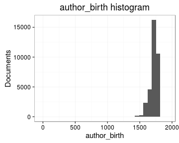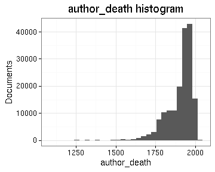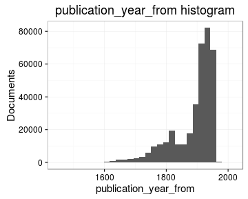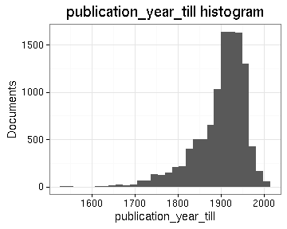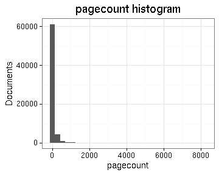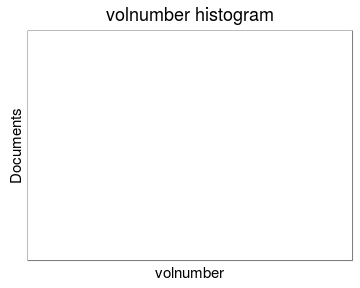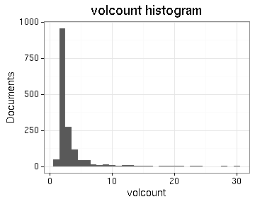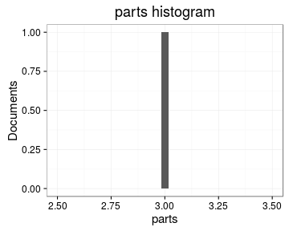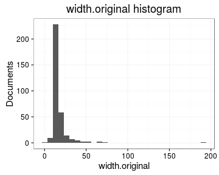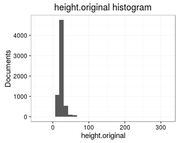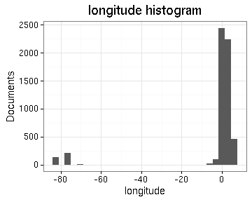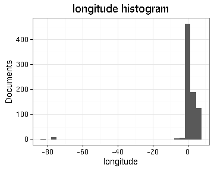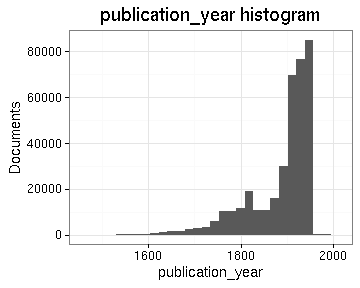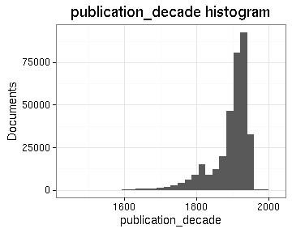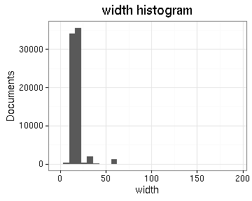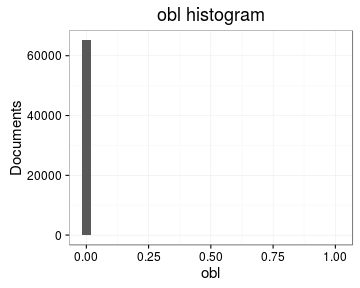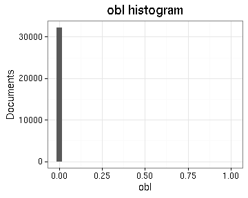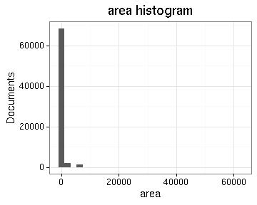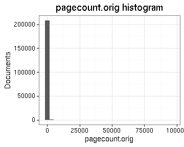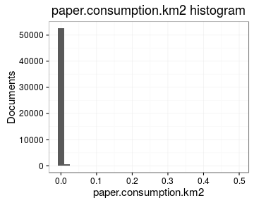

## Histograms of the top entries for factor variables

Non-trivial factors with at least 2 levels are shown.

