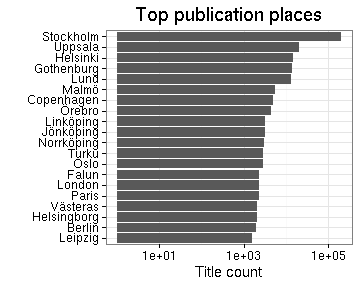
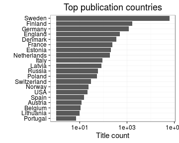

### Publication places

 * 1104 [publication places](output.tables/publication_place_accepted.csv)
 * 23 [publication countries](output.tables/country_accepted.csv) 
 * Publication place is identified for 71947 documents (98%). 
 * Publication country is identified for 67623 documents (92%).
 * 1.1% of the documents could be matched to geographic coordinates (based on the [Geonames](http://download.geonames.org/export/dump/) database). See the [list of places missing geocoordinate information](output.tables/absentgeocoordinates.csv). Altogether ``98.88``% of the documents have missing geocoordinates.
 * [Places with unknown publication country](output.tables/publication_place_missingcountry.csv) (can be added to [country mappings](https://github.com/rOpenGov/bibliographica/blob/master/inst/extdata/reg2country.csv))
 * [Ambiguous publication places](output.tables/publication_place_ambiguous.csv)
 * [Potentially ambiguous region-country mappings](output.tables/publication_country_ambiguous.csv) (these may occur in the data in various synonymes and the country is not always clear when multiple countries have a similar place name; the default country is listed first)
 * [Discarded publication places](output.tables/publication_place_discarded.csv) (add to [synonyme list](https://github.com/rOpenGov/bibliographica/blob/master/inst/extdata/PublicationPlaceSynonymes.csv) to accept; or add to [publication place stopwords](https://github.com/rOpenGov/bibliographica/blob/master/inst/extdata/stopwords_for_place.csv) to completely discard the term)
 * [Conversions from the original to the accepted place names](output.tables/publication_place_conversion_nontrivial.csv)

Top-20 publication places are shown together with the number of documents.




### Top publication countries


```
## Error in Math.factor(structure(c(22L, 21L, 20L, 19L, 18L, 17L, 16L, 15L, : 'round' not meaningful for factors
```


|Country |Documents (n) |Fraction (%)      |
|:-------|:-------------|:-----------------|
|Sweden  |62843         |85.8792500273314  |
|Finland |1701          |2.32453263365038  |
|Germany |1172          |1.60161801683612  |
|England |488           |0.666885317590467 |
|Denmark |355           |0.48513173718159  |
|France  |239           |0.326609817426479 |

