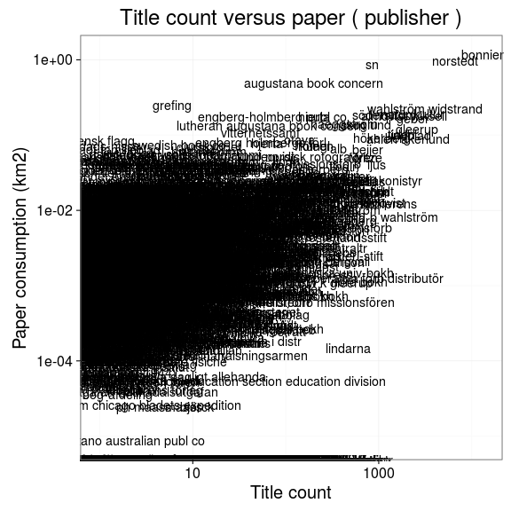

### Publishers

 * 19037 [unique publishers](output.tables/publisher_accepted.csv)

 * 371322 documents have unambiguous publisher information (100%). 

 * [Discarded publisher entries](output.tables/publisher_discarded.csv)

 * [Conversions from original to final names](output.tables/publisher_nontrivial_conversions.csv) (only non-trivial conversions shown)

The 20 most common publishers are shown with the number of documents. 

### Publication timeline for top publishers

Title count

Title count versus paper consumption (top publishers):

|publisher             | titles| paper|
|:---------------------|------:|-----:|
|                      | 192348| 34.87|
|Bonnier               |  13585|  1.21|
|Förf                  |   2912|  0.08|
|Geber                 |   2425|  0.17|
|Gleerup               |   2684|  0.13|
|Kongl. tryckeriet     |   5063|  0.51|
|Natur & Coultur       |   2308|  0.19|
|Norstedt              |   6817|  1.01|
|Sverige               |  11627|  2.84|
|Wahlström & Widstrand |   3204|  0.23|
