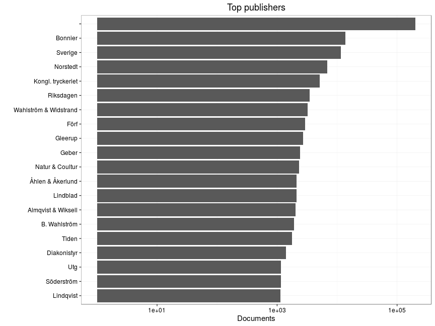
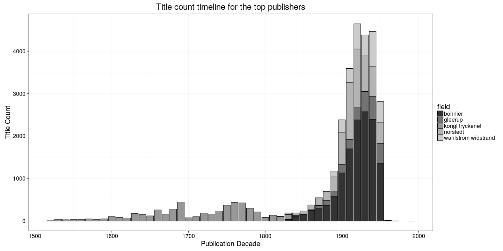

### Publishers

[Publishers accepted](output.tables/publisher_accepted.csv)

[Publishers discarded](output.tables/publisher_discarded.csv)

[Publishers discarded](output.tables/publisher_nontrivial_conversions.csv)


```
## Error in `[.data.frame`(x, , field): undefined columns selected
```

The 20 most common publishers are shown with the number of documents. Publisher information is available for 0 documents (NaN%). There are 36 unique publisher names (some may be synonymes, though).


```
## Error in dfs$names: $ operator is invalid for atomic vectors
```



### Publication timeline for top publishers

Title count


```
## Error in `[.data.frame`(x, , field): undefined columns selected
```

```
## Error in eval(expr, envir, enclos): object 'tops' not found
```




Title count versus paper consumption (top publishers):


```
## Error in compare_title_paper(df, "publisher", selected = tops): object 'tops' not found
```

```
## NULL
```

```
## Error in kable_markdown(x = structure(character(0), .Dim = c(0L, 0L), .Dimnames = list(: the table must have a header (column names)
```
