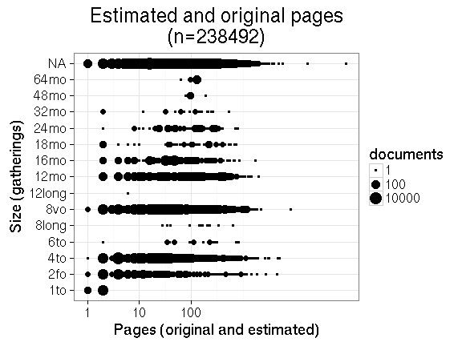
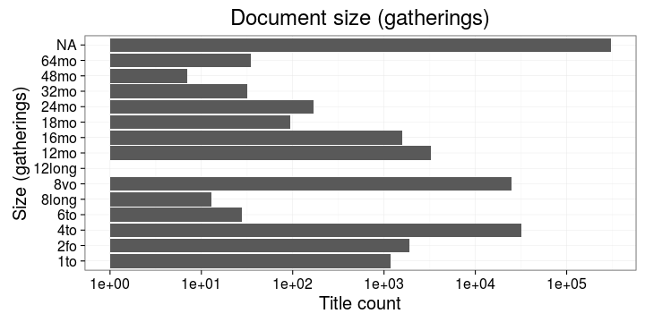
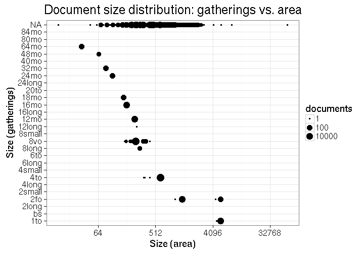
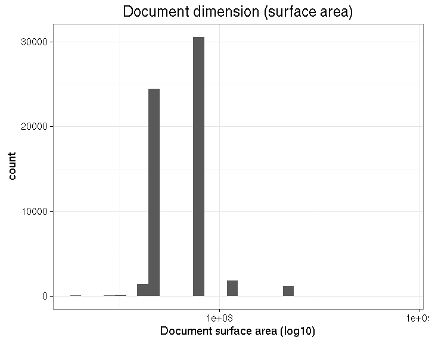
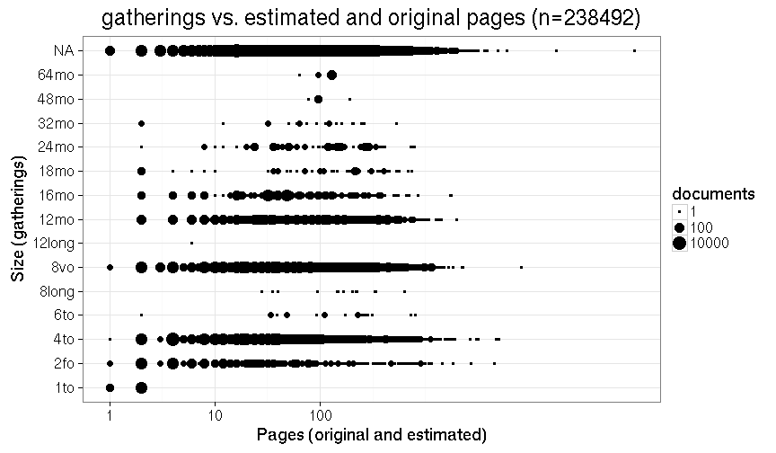
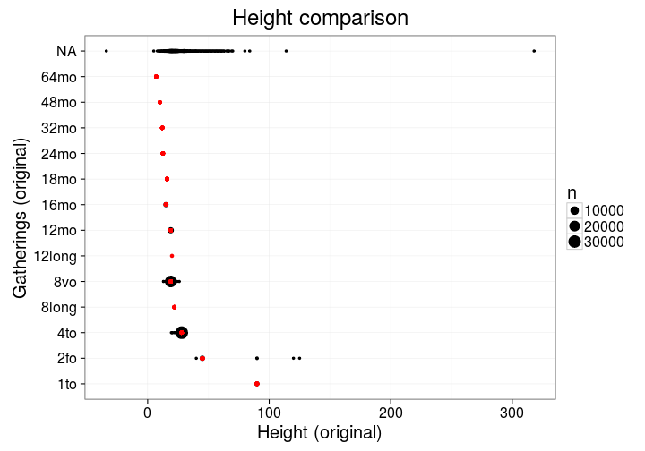
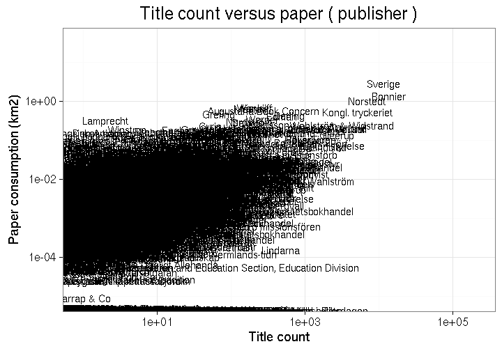
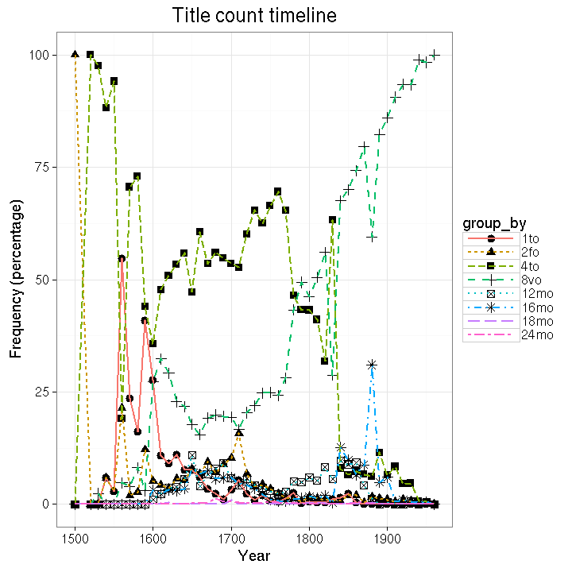
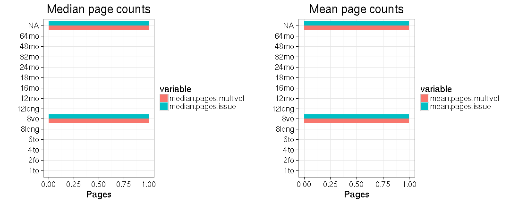
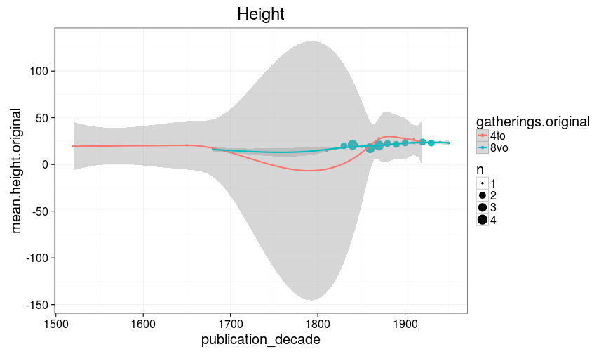

```r
#opts_chunk$set(comment=NA, fig.width=6, fig.height=6)
opts_chunk$set(fig.path = "figure/size-")
```


## Page counts

  * Page count missing and estimated for 2019 documents (0.0054373%).

  * Page count missing and could not be estimated for 134411 documents

  * Page count updated for 0 documents.
  
  * [Conversions from raw data to final page count estimates](output.tables/pagecount_conversion_nontrivial.csv)

<!--[Page conversions from raw data to final page count estimates with volume info](output.tables/page_conversion_table_full.csv)-->

  * [Discarded pagecount info](output.tables/pagecount_discarded.csv)

  * [Automated tests for page count conversions](https://github.com/rOpenGov/bibliographica/blob/master/inst/extdata/tests_polish_physical_extent.csv)


Visual summary of the estimated page counts per gatherings (shown only for the 2019 documents that have missing pagecount info in the original data):



## Document size comparisons

[Incomplete dimension info - document surface are could not be estimated](output.tables/physical_dimension_incomplete.csv)

[Dimension conversion table](output.tables/conversions_physical_dimension.csv)

[Automated tests for dimension conversions](https://github.com/rOpenGov/bibliographica/blob/master/inst/extdata/tests_dimension_polish.csv)

These include estimates that are based on auxiliary information sheets:

  * [Document dimension abbreviations](https://github.com/rOpenGov/bibliographica/blob/master/inst/extdata/document_size_abbreviations.csv)

  * [Standard sheet size estimates](https://github.com/rOpenGov/bibliographica/blob/master/inst/extdata/sheetsizes.csv)

  * [Document dimension estimates](https://github.com/rOpenGov/bibliographica/blob/master/inst/extdata/documentdimensions.csv) (used when information is partially missing)


  
<!--[Discarded dimension info](output.tables/dimensions_discarded.csv)-->

Document size (area) info in area is available for 71684 documents (19%). Estimates of document size (area) info in gatherings system are available for 371321 documents (100%). 




Compare gatherings and area sizes as a quality check. This includes all data; the area has been estimated from the gatherings when dimension information was not available.



Document dimension histogram (surface area). Few document sizes dominate publishing.




Compare gatherings and page counts. 




Compare original gatherings and original heights where both are available. The point size indicates the number of documents with the corresponding combination. The red dots indicate the estimated height that is used when only gathering information is available. It seems that in most documents, the given height is smaller than the correponding estimate.



### Gatherings timelines


```
## Error: All columns must be named
```

```
## Error: All columns must be named
```




<!--

## Average page counts (only works in CERL now)

Multi-volume documents average page counts are given per volume.


|doc.dimension |mean.pages.singlevol |median.pages.singlevol | n.singlevol| mean.pages.multivol| median.pages.multivol| n.multivol| mean.pages.issue| median.pages.issue| n.issue|
|:-------------|:--------------------|:----------------------|-----------:|-------------------:|---------------------:|----------:|----------------:|------------------:|-------:|
|2fo           |NA                   |NA                     |        1824|                  NA|                    NA|         NA|               NA|                 NA|      92|
|4to           |NA                   |NA                     |       31861|                  NA|                    NA|         NA|               NA|                 NA|   31874|
|6to           |NA                   |NA                     |          27|                  NA|                    NA|         NA|               NA|                 NA|       1|
|8long         |NA                   |NA                     |          13|                  NA|                    NA|         NA|               NA|                 NA|      NA|
|8vo           |NA                   |NA                     |       24877|                   1|                     1|         94|                1|                  1|      30|
|12long        |NA                   |NA                     |           1|                  NA|                    NA|         NA|               NA|                 NA|      NA|
|12mo          |NA                   |NA                     |        3269|                 NaN|                    NA|         20|              NaN|                 NA|       3|
|16mo          |NA                   |NA                     |        1593|                 NaN|                    NA|          6|               NA|                 NA|      NA|
|18mo          |NA                   |NA                     |          94|                  NA|                    NA|         NA|               NA|                 NA|      NA|
|24mo          |NA                   |NA                     |         169|                  NA|                    NA|         NA|               NA|                 NA|      NA|
|32mo          |NA                   |NA                     |          32|                  NA|                    NA|         NA|               NA|                 NA|      NA|
|48mo          |NA                   |NA                     |           7|                  NA|                    NA|         NA|               NA|                 NA|      NA|
|64mo          |NA                   |NA                     |          35|                  NA|                    NA|         NA|               NA|                 NA|      NA|
|NA            |NA                   |NA                     |      304078|                   1|                     1|       1930|                1|                  1|    2482|
|1to           |NA                   |NA                     |          NA|                  NA|                    NA|         NA|               NA|                 NA|    1175|





## Average document dimensions 

Here we use the original data only:




Only the most frequently occurring gatherings are listed here:


|gatherings.original |mean.width |median.width | mean.height| median.height|  n|
|:-------------------|:----------|:------------|-----------:|-------------:|--:|
|4to                 |NA         |NA           |       23.57|         23.57|  7|
|8vo                 |NA         |NA           |       20.65|         20.65| 31|

-->
