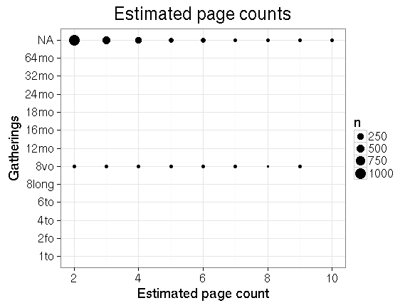
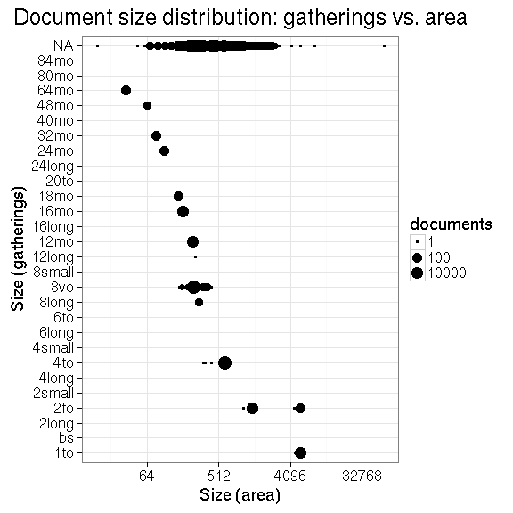
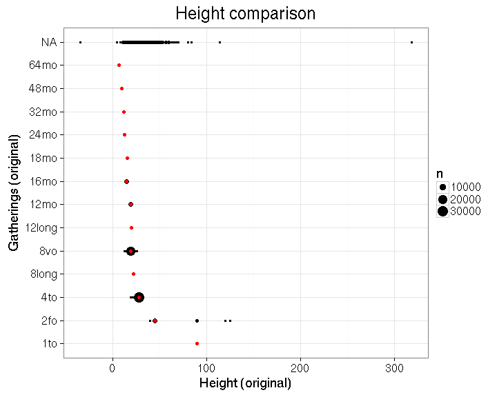

## Page counts

  * Page count missing and estimated for 2031 documents (0.5%).

  * Page count missing and could not be estimated for 147279 documents

  * Page count updated for 0 documents.
  
  * [Conversions from raw data to final page count estimates](output.tables/pagecount_conversion_nontrivial.csv)

<!--[Page conversions from raw data to final page count estimates with volume info](output.tables/page_conversion_table_full.csv)-->

  * [Discarded pagecount info](output.tables/pagecount_discarded.csv)

  * [Automated tests for page count conversions](https://github.com/rOpenGov/bibliographica/blob/master/inst/extdata/tests_polish_physical_extent.csv)

Left: Gatherings vs. overall pagecounts (original + estimated). Right: Only the estimated page counts (shown only for the 2031 documents that have missing pagecount info in the original data):

## Document size comparisons

  * Some dimension info is provided in the original raw data for altogether 73866 documents (19.1%) but could not be interpreted for 8213 documents (ie. dimension info was successfully estimated for 88.9 % of the documents where this field was not empty).

  * Document size (area) info was obtained in the final preprocessed data for altogether 73551 documents (19%). For the remaining documents, critical dimension information was not available or could not be interpreted: [List of entries where document surface could not be estimated](output.tables/physical_dimension_incomplete.csv)

  * Document gatherings info is originally available for 65653 documents (17%), and further estimated up to 65653 documents (17%) in the final preprocessed data.

  * Document height info is originally available for 7970 documents (2%), and further estimated up to 73551 documents (19%) in the final preprocessed data.

  * Document width info is originally available for 333 documents (0%), and further estimated up to 73551 documents (19%) in the final preprocessed data.

These tables can be used to verify the accuracy of the conversions from the raw data to final estimates:

  * [Dimension conversions from raw data to final estimates](output.tables/conversions_physical_dimension.csv)

  * [Automated tests for dimension conversions](https://github.com/rOpenGov/bibliographica/blob/master/inst/extdata/tests_dimension_polish.csv)

The estimates are based on the following auxiliary information sheets:

  * [Document dimension abbreviations](https://github.com/rOpenGov/bibliographica/blob/master/inst/extdata/document_size_abbreviations.csv)

  * [Standard sheet size estimates](https://github.com/rOpenGov/bibliographica/blob/master/inst/extdata/sheetsizes.csv)

  * [Document dimension estimates](https://github.com/rOpenGov/bibliographica/blob/master/inst/extdata/documentdimensions.csv) (used when information is partially missing)

  
<!--[Discarded dimension info](output.tables/dimensions_discarded.csv)-->

Estimates of document size (area) info in gatherings system are available for 385771 documents (100%). Also compare gatherings and area sizes as a quality check. This includes all data; the area has been estimated from the gatherings when dimension information was not available.

Left: Document dimension histogram (surface area). Few document sizes dominate publishing. Right: original gatherings versus original heights where both are available. The point size indicates the number of documents with the corresponding combination. The red dots indicate the estimated height that is used when only gathering information is available. It seems that in most documents, the given height is smaller than the correponding estimate.

### Gatherings timelines

<!--

## Average page counts (only works in CERL now)

Multi-volume documents average page counts are given per volume.

|doc.dimension |mean.pages.singlevol |median.pages.singlevol | n.singlevol| mean.pages.multivol| median.pages.multivol| n.multivol| mean.pages.issue| median.pages.issue| n.issue|
|:-------------|:--------------------|:----------------------|-----------:|-------------------:|---------------------:|----------:|----------------:|------------------:|-------:|
|2fo           |NA                   |NA                     |        1858|                  NA|                    NA|         NA|               NA|                 NA|      93|
|4to           |NA                   |NA                     |       32051|                  NA|                    NA|         NA|               NA|                 NA|   32064|
|6to           |NA                   |NA                     |          28|                  NA|                    NA|         NA|               NA|                 NA|       1|
|8long         |NA                   |NA                     |          14|                  NA|                    NA|         NA|               NA|                 NA|      NA|
|8vo           |NA                   |NA                     |       25060|                   1|                     1|         95|                1|                  1|      30|
|12long        |NA                   |NA                     |           1|                  NA|                    NA|         NA|               NA|                 NA|      NA|
|12mo          |NA                   |NA                     |        3288|                 NaN|                    NA|         20|              NaN|                 NA|       3|
|16mo          |NA                   |NA                     |        1599|                 NaN|                    NA|          6|               NA|                 NA|      NA|
|18mo          |NA                   |NA                     |          95|                  NA|                    NA|         NA|               NA|                 NA|      NA|
|24mo          |NA                   |NA                     |         171|                  NA|                    NA|         NA|               NA|                 NA|      NA|
|32mo          |NA                   |NA                     |          32|                  NA|                    NA|         NA|               NA|                 NA|      NA|
|48mo          |NA                   |NA                     |           7|                  NA|                    NA|         NA|               NA|                 NA|      NA|
|64mo          |NA                   |NA                     |          35|                  NA|                    NA|         NA|               NA|                 NA|      NA|
|NA            |NA                   |NA                     |      318072|                   1|                     1|       1941|                1|                  1|    3596|
|1to           |NA                   |NA                     |          NA|                  NA|                    NA|         NA|               NA|                 NA|    1180|

## Average document dimensions 

Here we use the original data only:

Only the most frequently occurring gatherings are listed here:

|gatherings.original |mean.width |median.width | mean.height| median.height|  n|
|:-------------------|:----------|:------------|-----------:|-------------:|--:|
|4to                 |NA         |NA           |       23.57|         23.57|  7|
|8vo                 |NA         |NA           |       20.59|         20.59| 32|

-->
