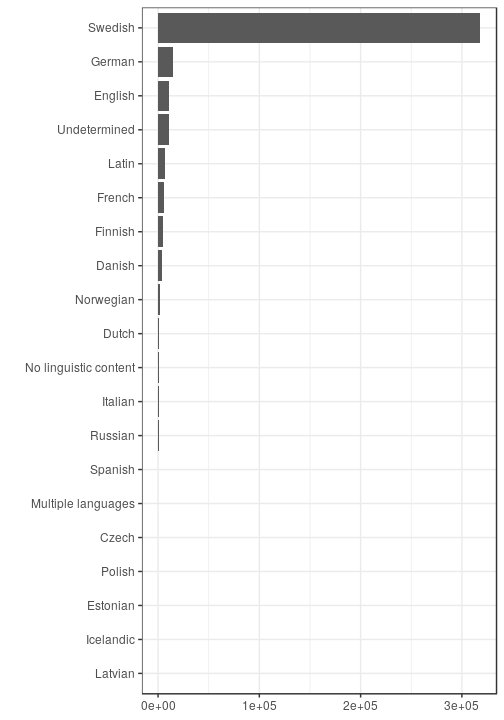

## Language

 * 98 [unique languages](output.tables/language_accepted.csv)
 * 98 [unique primary languages](output.tables/language_accepted.csv)  
 * 385771 single-language documents (100%)
 * 0 multilingual documents (0%) 
 * [Conversions from raw to preprocessed language entries](output.tables/language_conversions.csv) 
 * 124502 documents (32.27%) with [unrecognized language](output.tables/language_discarded.csv)

Language codes are from [MARC](http://www.loc.gov/marc/languages/language_code.html); new custom abbreviations can be added in [this table](https://github.com/COMHIS/bibliographica/blob/master/inst/extdata/language_abbreviations.csv).

Title count per language (including multi-language documents):

### Top languages

Number of documents assigned with each language (top-10). For a complete list,
see [accepted languages](output.tables/language_accepted.csv).

|Language     |Documents (n) |Fraction (%) |
|:------------|:-------------|:------------|
|Swedish      |210902        |54.7         |
|Undetermined |124502        |32.3         |
|German       |12587         |3.3          |
|English      |7570          |2            |
|Latin        |7208          |1.9          |
|French       |5321          |1.4          |
|Finnish      |4421          |1.1          |
|Danish       |4305          |1.1          |
|Norwegian    |2088          |0.5          |
|Dutch        |1153          |0.3          |

