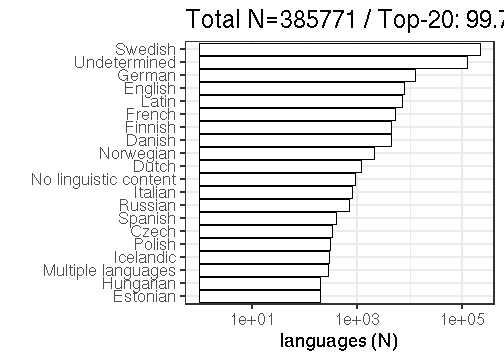

## Language

 * 44 unique languages
 * The languages may come in [combinations](output.tables/language_conversions.csv)
 * 3 multilingual documents (0.08%)  
 * 243 docs (6.39%) with no recognized language 
 * [Discarded languages](output.tables/language_discarded.csv)

Language codes are from [MARC](http://www.loc.gov/marc/languages/language_code.html); new custom abbreviations can be added in [this table](https://github.com/rOpenGov/bibliographica/blob/master/inst/extdata/language_abbreviations.csv).

Title count per language (including multi-language documents):

### Top languages

|Language | Documents (n)| Fraction (%)|
|:--------|-------------:|------------:|
|Swedish  |          3025|         85.1|
|Latin    |           289|          8.1|
|German   |           103|          2.9|
|French   |            65|          1.8|
|Finnish  |            19|          0.5|
|English  |            16|          0.5|

