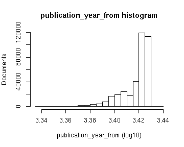
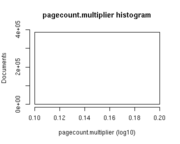
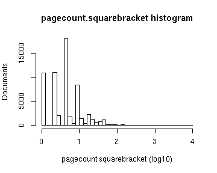
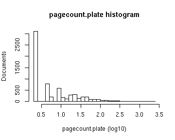
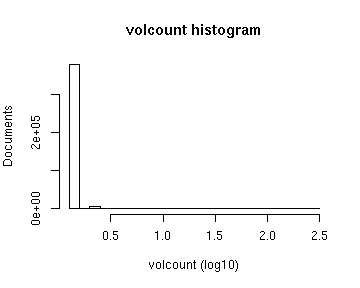
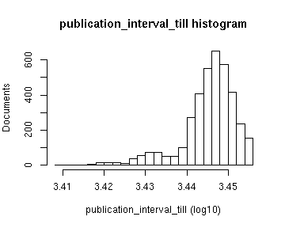
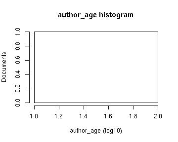

# Preprocessing summary

## Specific fields

  * [Author info](author.md)
  * [Gender info](gender.md)
  * [Publisher info](publisher.md)
  * [Publication geography](publicationplace.md)
  * [Publication year info](publicationyear.md)
  * [Titles](title.md)  
  * [Page counts](pagecount.md)
  * [Physical dimension](dimension.md)    
  * [Document and subject topics](topic.md)
  * [Languages](language.md)

## Field conversions

This documents the conversions from raw data to the final preprocessed version (accepted, discarded, conversions). Only some of the key tables are explicitly linked below. The complete list of all summary tables is [here](output.tables/).

## Annotated documents

Fraction of documents with data:

Same in exact numbers: documents with available/missing entries, and number of unique entries for each field. Sorted by missing data:

|field name                                   | missing (%)| available (%)| available (n)| unique (n)|
|:--------------------------------------------|-----------:|-------------:|-------------:|----------:|
|volnumber                                    |       100.0|           0.0|             0|          1|
|parts                                        |       100.0|           0.0|             0|          1|
|uncontrolled                                 |       100.0|           0.0|             0|          1|
|note_granter                                 |       100.0|           0.0|             1|          2|
|note_year                                    |       100.0|           0.0|             1|          2|
|holder                                       |       100.0|           0.0|             1|          2|
|width.original                               |       100.0|           0.0|             5|          6|
|physical_accomppanied                        |       100.0|           0.0|             7|          8|
|publication_frequency                        |       100.0|           0.0|            11|         11|
|height.original                              |       100.0|           0.0|            22|         20|
|772c                                         |       100.0|           0.0|            22|         12|
|note_510c                                    |        99.9|           0.1|            49|         47|
|successor                                    |        99.9|           0.1|            57|         58|
|volcount                                     |        99.9|           0.1|            77|         16|
|866x                                         |        99.9|           0.1|            93|         13|
|110a                                         |        99.8|           0.2|           115|         77|
|publication_interval                         |        99.7|           0.3|           222|        208|
|440v                                         |        99.6|           0.4|           272|        211|
|note_source                                  |        99.6|           0.4|           288|        231|
|physical_details                             |        99.6|           0.4|           305|         59|
|650y                                         |        99.4|           0.6|           453|         95|
|440a                                         |        99.3|           0.7|           482|        289|
|latitude                                     |        98.9|           1.1|           818|         13|
|longitude                                    |        98.9|           1.1|           818|         13|
|publication_year_till                        |        98.0|           2.0|          1431|        225|
|title_uniform                                |        98.0|           2.0|          1467|        872|
|260e                                         |        97.9|           2.1|          1513|         72|
|subject_geography                            |        97.7|           2.3|          1712|        790|
|245c                                         |        97.0|           3.0|          2208|       2014|
|650x                                         |        96.7|           3.3|          2383|        440|
|650z                                         |        94.1|           5.9|          4348|        808|
|772d                                         |        90.7|           9.3|          6799|       1188|
|772t                                         |        90.5|           9.5|          6924|       2426|
|first_edition                                |        86.7|          13.3|          9705|          3|
|uncontrolled_title                           |        82.5|          17.5|         12841|      11544|
|700d                                         |        81.4|          18.6|         13604|       3684|
|700a                                         |        78.4|          21.6|         15774|       5849|
|852z                                         |        78.1|          21.9|         15999|       2958|
|subject_topic                                |        76.8|          23.2|         17012|      10098|
|976a                                         |        73.4|          26.6|         19500|       4244|
|976b                                         |        73.4|          26.6|         19500|       4300|
|corporate                                    |        73.1|          26.9|         19701|        829|
|title_remainder                              |        72.3|          27.7|         20291|      18445|
|900d                                         |        68.0|          32.0|         23411|       4674|
|900a                                         |        67.9|          32.1|         23480|       4883|
|900u                                         |        67.9|          32.1|         23480|       4823|
|author_gender                                |        62.0|          38.0|         27772|          4|
|author_death                                 |        54.4|          45.6|         33404|        376|
|author_birth                                 |        52.9|          47.1|         34475|        381|
|self_published                               |        47.7|          52.3|         38263|          2|
|author_name                                  |        47.5|          52.5|         38396|       9982|
|author                                       |        47.5|          52.5|         38396|      10123|
|260f                                         |        40.5|          59.5|         43529|       2245|
|852j                                         |        34.9|          65.1|         47664|      17021|
|paper.consumption.km2                        |        31.0|          69.0|         50526|       1723|
|pagecount.orig                               |        28.0|          72.0|         52656|        868|
|pagecount                                    |        28.0|          72.0|         52712|        868|
|width                                        |        18.5|          81.5|         59652|         27|
|height                                       |        18.5|          81.5|         59652|         29|
|area                                         |        18.5|          81.5|         59652|         32|
|obl                                          |        18.5|          81.5|         59658|          3|
|note_general                                 |        13.6|          86.4|         63228|      33434|
|language                                     |         6.0|          94.0|         68770|         32|
|country                                      |         6.0|          94.0|         68783|         25|
|publication_place                            |         3.4|          96.6|         70687|        302|
|dissertation                                 |         2.5|          97.5|         71347|          3|
|synodal                                      |         2.5|          97.5|         71347|          2|
|publisher                                    |         0.5|          99.5|         72788|        804|
|publication_year_from                        |         0.0|         100.0|         73174|        322|
|language.Swedish                             |         0.0|         100.0|         73176|          2|
|language.English                             |         0.0|         100.0|         73176|          2|
|language.French                              |         0.0|         100.0|         73176|          2|
|language.Danish                              |         0.0|         100.0|         73176|          2|
|language.Latin                               |         0.0|         100.0|         73176|          2|
|language.Icelandic                           |         0.0|         100.0|         73176|          2|
|language.Italian                             |         0.0|         100.0|         73176|          2|
|language.German                              |         0.0|         100.0|         73176|          2|
|language.Russian                             |         0.0|         100.0|         73176|          2|
|language.Norwegian                           |         0.0|         100.0|         73176|          2|
|language.Greek, Ancient (to 1453)            |         0.0|         100.0|         73176|          1|
|language.Old Norse                           |         0.0|         100.0|         73176|          2|
|language.Finnish                             |         0.0|         100.0|         73176|          2|
|language.Pali                                |         0.0|         100.0|         73176|          1|
|language.Estonian                            |         0.0|         100.0|         73176|          2|
|language.Polish                              |         0.0|         100.0|         73176|          2|
|language.Arabic                              |         0.0|         100.0|         73176|          2|
|language.Esperanto                           |         0.0|         100.0|         73176|          1|
|language.Dutch                               |         0.0|         100.0|         73176|          2|
|language.Spanish                             |         0.0|         100.0|         73176|          2|
|language.Latvian                             |         0.0|         100.0|         73176|          2|
|language.Bulgarian                           |         0.0|         100.0|         73176|          1|
|language.Hungarian                           |         0.0|         100.0|         73176|          1|
|language.Afrikaans                           |         0.0|         100.0|         73176|          1|
|language.Japanese                            |         0.0|         100.0|         73176|          1|
|language.Czech                               |         0.0|         100.0|         73176|          1|
|language.Portuguese                          |         0.0|         100.0|         73176|          2|
|language.Serbian                             |         0.0|         100.0|         73176|          1|
|language.Turkish                             |         0.0|         100.0|         73176|          1|
|language.Norwegian (Nynorsk)                 |         0.0|         100.0|         73176|          1|
|language.Low German                          |         0.0|         100.0|         73176|          2|
|language.Gothic                              |         0.0|         100.0|         73176|          2|
|language.Sami                                |         0.0|         100.0|         73176|          2|
|language.Albanian                            |         0.0|         100.0|         73176|          2|
|language.Hebrew                              |         0.0|         100.0|         73176|          2|
|language.No linguistic content               |         0.0|         100.0|         73176|          2|
|language.Khotanese                           |         0.0|         100.0|         73176|          1|
|language.Chinese                             |         0.0|         100.0|         73176|          1|
|language.Ukrainian                           |         0.0|         100.0|         73176|          1|
|language.Ethiopic                            |         0.0|         100.0|         73176|          1|
|language.French, Old (ca. 842-1300)          |         0.0|         100.0|         73176|          1|
|language.Syriac, Modern                      |         0.0|         100.0|         73176|          2|
|language.Amharic                             |         0.0|         100.0|         73176|          1|
|language.Croatian                            |         0.0|         100.0|         73176|          1|
|language.Algonquian (Other)                  |         0.0|         100.0|         73176|          1|
|language.Greek, Modern (1453-)               |         0.0|         100.0|         73176|          1|
|language.Slovenian                           |         0.0|         100.0|         73176|          1|
|language.Romanian                            |         0.0|         100.0|         73176|          1|
|language.Tigrinya                            |         0.0|         100.0|         73176|          1|
|language.Faroese                             |         0.0|         100.0|         73176|          1|
|language.Catalan                             |         0.0|         100.0|         73176|          1|
|language.Provençal (to 1500)                 |         0.0|         100.0|         73176|          1|
|language.Raeto-Romance                       |         0.0|         100.0|         73176|          1|
|language.Sanskrit                            |         0.0|         100.0|         73176|          1|
|language.Lithuanian                          |         0.0|         100.0|         73176|          2|
|language.Zulu                                |         0.0|         100.0|         73176|          1|
|language.Sorbian (Other)                     |         0.0|         100.0|         73176|          1|
|language.Georgian                            |         0.0|         100.0|         73176|          1|
|language.Slovak                              |         0.0|         100.0|         73176|          1|
|language.Yiddish                             |         0.0|         100.0|         73176|          1|
|language.Tigré                               |         0.0|         100.0|         73176|          1|
|language.Lule Sami                           |         0.0|         100.0|         73176|          1|
|language.Kalâtdlisut                         |         0.0|         100.0|         73176|          1|
|language.Armenian                            |         0.0|         100.0|         73176|          1|
|language.Hindi                               |         0.0|         100.0|         73176|          1|
|language.Oriya                               |         0.0|         100.0|         73176|          1|
|language.Ido                                 |         0.0|         100.0|         73176|          1|
|language.Uighur                              |         0.0|         100.0|         73176|          1|
|language.Frisian                             |         0.0|         100.0|         73176|          1|
|language.Korean                              |         0.0|         100.0|         73176|          1|
|language.Kongo                               |         0.0|         100.0|         73176|          1|
|language.Swahili                             |         0.0|         100.0|         73176|          1|
|language.German, Middle High (ca. 1050-1500) |         0.0|         100.0|         73176|          1|
|language.Kinyarwanda                         |         0.0|         100.0|         73176|          1|
|language.Artificial (Other)                  |         0.0|         100.0|         73176|          1|
|language.Macedonian                          |         0.0|         100.0|         73176|          1|
|language.Nilo-Saharan (Other)                |         0.0|         100.0|         73176|          1|
|language.Aramaic                             |         0.0|         100.0|         73176|          1|
|language.English, Middle (1100-1500)         |         0.0|         100.0|         73176|          1|
|language.French, Middle (ca. 1300-1600)      |         0.0|         100.0|         73176|          1|
|language.Oromo                               |         0.0|         100.0|         73176|          1|
|language.Finno-Ugrian (Other)                |         0.0|         100.0|         73176|          1|
|language.Southern Sami                       |         0.0|         100.0|         73176|          1|
|language.Cushitic (Other)                    |         0.0|         100.0|         73176|          1|
|language.Hiligaynon                          |         0.0|         100.0|         73176|          1|
|language.Bantu (Other)                       |         0.0|         100.0|         73176|          1|
|language.Somali                              |         0.0|         100.0|         73176|          1|
|language.Indonesian                          |         0.0|         100.0|         73176|          1|
|language.Romani                              |         0.0|         100.0|         73176|          1|
|language.Malayalam                           |         0.0|         100.0|         73176|          1|
|language.Berber (Other)                      |         0.0|         100.0|         73176|          1|
|language.Kuanyama                            |         0.0|         100.0|         73176|          1|
|language.Welsh                               |         0.0|         100.0|         73176|          1|
|language.Niger-Kordofanian (Other)           |         0.0|         100.0|         73176|          1|
|language.Malagasy                            |         0.0|         100.0|         73176|          1|
|language.Northern Sami                       |         0.0|         100.0|         73176|          1|
|language.Persian                             |         0.0|         100.0|         73176|          1|
|language.Multiple languages                  |         0.0|         100.0|         73176|          2|
|title                                        |         0.0|         100.0|         73176|      66554|
|gatherings.original                          |         0.0|         100.0|         73176|         14|
|obl.original                                 |         0.0|         100.0|         73176|          2|
|original_row                                 |         0.0|         100.0|         73176|      73176|
|author_pseudonyme                            |         0.0|         100.0|         73176|          2|
|publication_year                             |         0.0|         100.0|         73176|        321|
|publication_decade                           |         0.0|         100.0|         73176|         36|
|gatherings                                   |         0.0|         100.0|         73176|         14|
|singlevol                                    |         0.0|         100.0|         73176|          2|
|multivol                                     |         0.0|         100.0|         73176|          2|
|issue                                        |         0.0|         100.0|         73176|          2|

## Histograms of all entries for numeric variables

## Histograms of the top entries for factor variables

Non-trivial factors with at least 2 levels are shown.

