# Preprocessing summary

The data spanning years 1457-2012 has been included and contains 385771 documents (also other filter may apply depending on the data collection, see the source code for details.


## Specific fields

  * [Author info](author.md)
  * [Gender info](gender.md)
  * [Publisher info](publisher.md)
  * [Publication geography](publicationplace.md)
  * [Publication year info](publicationyear.md)
  * [Titles](title.md)  
  * [Page counts](pagecount.md)
  * [Physical dimension](dimension.md)    
  * [Document and subject topics](topic.md)
  * [Languages](language.md)


## Annotated documents

  * 385771 documents in the original raw data
  * 385771 documents in the final preprocessed data (100%)

Fraction of documents with data:


Same in exact numbers: documents with available/missing entries, and number of unique entries for each field. Sorted by missing data:


|field name                   | available (%)| available (n)| missing (%)| unique (n)|
|:----------------------------|-------------:|-------------:|-----------:|----------:|
|volnumber                    |           0.0|             0|       100.0|          1|
|parts                        |           0.0|             1|       100.0|          2|
|holder                       |           0.0|             1|       100.0|          2|
|uncontrolled                 |           0.0|             3|       100.0|          4|
|note_year                    |           0.0|             4|       100.0|          5|
|note_granter                 |           0.0|             8|       100.0|          8|
|note_510c                    |           0.0|            50|       100.0|         48|
|width.original               |           0.1|           333|        99.9|         53|
|note_source                  |           0.2|           732|        99.8|        672|
|physical_accomppanied        |           0.3|          1310|        99.7|        795|
|successor                    |           0.5|          1737|        99.5|       1710|
|866x                         |           0.6|          2257|        99.4|        273|
|publication_frequency_annual |           0.8|          2938|        99.2|        192|
|publication_frequency_text   |           0.8|          3136|        99.2|         37|
|772c                         |           0.9|          3491|        99.1|       1049|
|publication_interval_till    |           1.0|          3759|        99.0|        227|
|publication_interval_from    |           1.0|          3790|        99.0|        235|
|650y                         |           1.1|          4071|        98.9|        954|
|subject_geography            |           1.7|          6626|        98.3|       2225|
|height.original              |           2.1|          7970|        97.9|         88|
|650x                         |           2.2|          8334|        97.8|       2108|
|110a                         |           2.3|          8868|        97.7|       6373|
|title_uniform                |           2.6|          9862|        97.4|       6078|
|publication_year_till        |           3.2|         12520|        96.8|        366|
|772d                         |           3.6|         13724|        96.4|       3221|
|772t                         |           3.6|         13904|        96.4|       4420|
|650z                         |           4.0|         15554|        96.0|       2636|
|260e                         |           6.4|         24770|        93.6|        715|
|440v                         |           8.7|         33566|        91.3|      10198|
|uncontrolled_title           |           8.8|         34003|        91.2|      30026|
|corporate                    |           9.1|         35002|        90.9|       6474|
|700d                         |          10.2|         39409|        89.8|      11748|
|subject_topic                |          11.1|         42890|        88.9|      22254|
|first_edition                |          11.8|         45331|        88.2|          3|
|physical_details             |          12.3|         47515|        87.7|        834|
|440a                         |          14.1|         54552|        85.9|      25284|
|700a                         |          15.8|         61108|        84.2|      32895|
|260f                         |          17.8|         68733|        82.2|       7362|
|obl                          |          17.9|         69054|        82.1|          3|
|paper                        |          19.1|         73531|        80.9|       4176|
|width                        |          19.1|         73551|        80.9|         63|
|height                       |          19.1|         73551|        80.9|         90|
|area                         |          19.1|         73551|        80.9|        195|
|245c                         |          26.3|        101465|        73.7|      77222|
|976a                         |          27.4|        105689|        72.6|      29699|
|976b                         |          27.4|        105689|        72.6|      30434|
|900d                         |          33.2|        127919|        66.8|      19778|
|900u                         |          34.2|        132073|        65.8|      24249|
|900a                         |          34.2|        132074|        65.8|      24535|
|note_general                 |          34.7|        133786|        65.3|      82777|
|author_age                   |          36.8|        142106|        63.2|        141|
|self_published               |          38.4|        148168|        61.6|          3|
|publisher                    |          43.3|        166967|        56.7|      16954|
|title_remainder              |          43.3|        166992|        56.7|     132055|
|author_death                 |          43.5|        167788|        56.5|        551|
|author_gender                |          44.3|        170875|        55.7|          5|
|author_birth                 |          47.1|        181703|        52.9|        587|
|pagecount.orig               |          61.9|        238695|        38.1|       1432|
|852z                         |          62.0|        239278|        38.0|      15781|
|author_name                  |          72.7|        280293|        27.3|      88144|
|author                       |          72.7|        280293|        27.3|      89395|
|852j                         |          91.3|        352283|         8.7|     133906|
|longitude                    |          94.0|        362746|         6.0|        568|
|latitude                     |          94.0|        362746|         6.0|        585|
|publication_country          |          94.1|        362962|         5.9|         39|
|publication_place            |          95.7|        369108|         4.3|       2637|
|publication_year_from        |          96.5|        372116|         3.5|        500|
|publication_year             |          96.5|        372136|         3.5|        500|
|publication_decade           |          96.5|        372136|         3.5|         57|
|dissertation                 |          98.2|        378851|         1.8|          3|
|synodal                      |          98.2|        378851|         1.8|          2|
|title                        |          99.4|        383297|         0.6|     333332|
|pagecount                    |         100.0|        385632|         0.0|       1437|
|pagecount.sheet              |         100.0|        385708|         0.0|       1144|
|volcount                     |         100.0|        385762|         0.0|         43|
|language_count               |         100.0|        385771|         0.0|          1|
|multilingual                 |         100.0|        385771|         0.0|          1|
|languages                    |         100.0|        385771|         0.0|         99|
|language_primary             |         100.0|        385771|         0.0|         99|
|pagecount.multiplier         |         100.0|        385771|         0.0|          1|
|pagecount.squarebracket      |         100.0|        385771|         0.0|        248|
|pagecount.plate              |         100.0|        385771|         0.0|        156|
|pagecount.arabic             |         100.0|        385771|         0.0|       1215|
|pagecount.roman              |         100.0|        385771|         0.0|        166|
|gatherings.original          |         100.0|        385771|         0.0|         15|
|obl.original                 |         100.0|        385771|         0.0|          2|
|original_row                 |         100.0|        385771|         0.0|     385771|
|pagecount_from               |         100.0|        385771|         0.0|          4|
|author_pseudonyme            |         100.0|        385771|         0.0|          2|
|gatherings                   |         100.0|        385771|         0.0|         16|
|singlevol                    |         100.0|        385771|         0.0|          2|
|multivol                     |         100.0|        385771|         0.0|          2|
|issue                        |         100.0|        385771|         0.0|          2|

```
##            used  (Mb) gc trigger   (Mb)  max used   (Mb)
## Ncells  5949551 317.8   17484008  933.8  34148455 1823.8
## Vcells 69522668 530.5  209331916 1597.1 217762639 1661.4
```


## Field conversions

This documents the conversions from raw data to the final preprocessed version (accepted, discarded, conversions). Only some of the key tables are explicitly linked below. The complete list of all summary tables is [here](output.tables/).

Brief description of the fields:

 * [Description of the original MARC fields](https://github.com/COMHIS/bibliographica/blob/master/inst/extdata/fieldnames.csv)

 * [Description of the preprocessed fields](https://github.com/COMHIS/bibliographica/blob/master/inst/extdata/fieldname_table.csv)


## Histograms of all entries for numeric variables

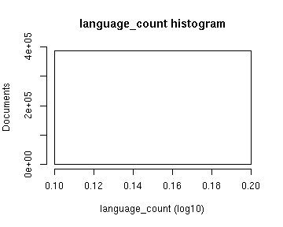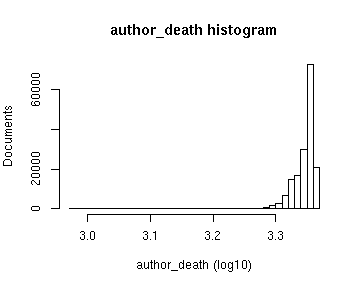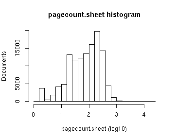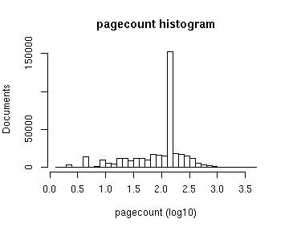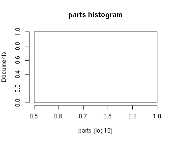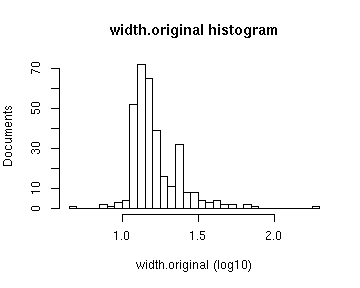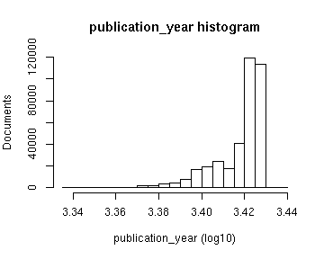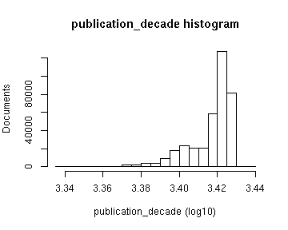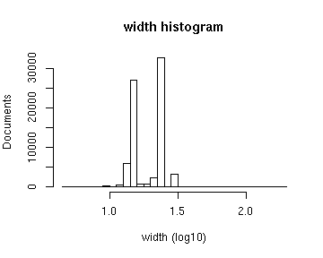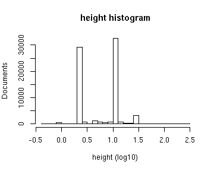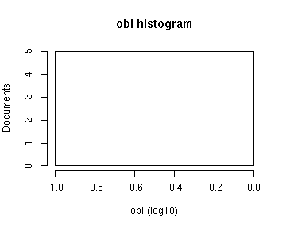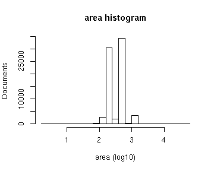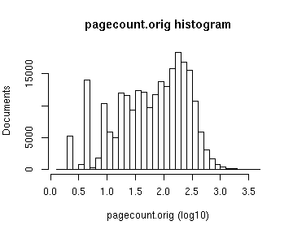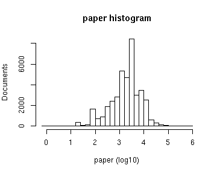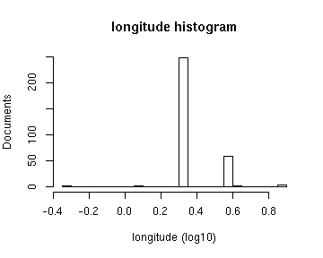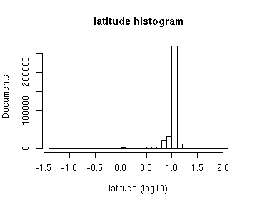


## Histograms of the top entries for factor variables

Non-trivial factors with at least 2 levels are shown.


