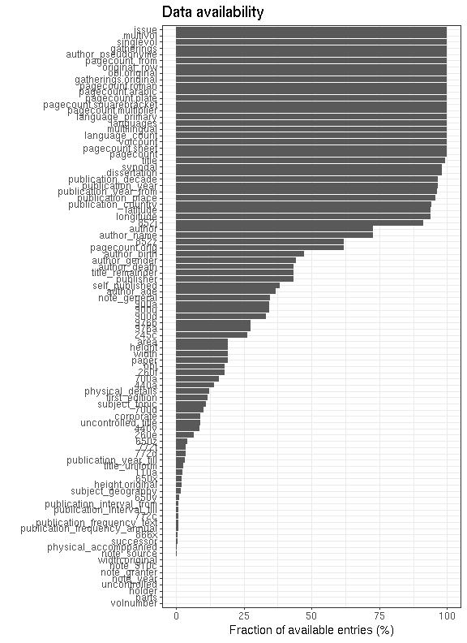
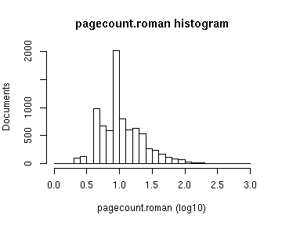
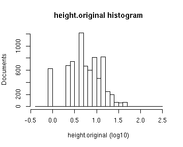
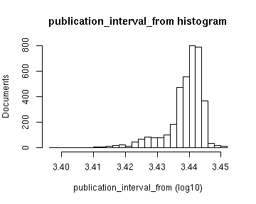

# Preprocessing summary

## Specific fields

  * [Author info](author.md)
  * [Gender info](gender.md)
  * [Publisher info](publisher.md)
  * [Publication geography](publicationplace.md)
  * [Publication year info](publicationyear.md)
  * [Titles](title.md)  
  * [Page counts](pagecount.md)
  * [Physical dimension](dimension.md)    
  * [Document and subject topics](topic.md)
  * [Languages](language.md)

## Field conversions

This documents the conversions from raw data to the final preprocessed version (accepted, discarded, conversions). Only some of the key tables are explicitly linked below. The complete list of all summary tables is [here](output.tables/).

## Annotated documents

Fraction of documents with data:

Same in exact numbers: documents with available/missing entries, and number of unique entries for each field. Sorted by missing data:

|field name                     | missing (%)| available (%)| available (n)| unique (n)|
|:------------------------------|-----------:|-------------:|-------------:|----------:|
|volnumber                      |       100.0|           0.0|             0|          1|
|parts                          |       100.0|           0.0|             0|          1|
|width.original                 |       100.0|           0.0|             0|          1|
|note_granter                   |       100.0|           0.0|             0|          1|
|note_year                      |       100.0|           0.0|             0|          1|
|uncontrolled                   |       100.0|           0.0|             0|          1|
|holder                         |       100.0|           0.0|             0|          1|
|height.original                |       100.0|           0.0|             1|          2|
|physical_accomppanied          |       100.0|           0.0|             1|          2|
|publication_frequency          |       100.0|           0.0|             1|          2|
|110a                           |        99.9|           0.1|             2|          3|
|772c                           |        99.9|           0.1|             2|          3|
|successor                      |        99.9|           0.1|             2|          3|
|volcount                       |        99.9|           0.1|             3|          3|
|note_510c                      |        99.9|           0.1|             3|          4|
|866x                           |        99.9|           0.1|             5|          3|
|self_published                 |        99.8|           0.2|             8|          2|
|publication_interval           |        99.7|           0.3|            10|         11|
|note_source                    |        99.7|           0.3|            11|         11|
|440v                           |        99.6|           0.4|            14|         15|
|physical_details               |        99.6|           0.4|            15|          7|
|440a                           |        99.3|           0.7|            27|         20|
|650y                           |        99.3|           0.7|            27|         17|
|title_uniform                  |        98.2|           1.8|            69|         65|
|publication_year_till          |        98.1|           1.9|            72|         57|
|260e                           |        98.1|           1.9|            73|         14|
|subject_geography              |        97.6|           2.4|            92|         74|
|245c                           |        96.8|           3.2|           121|        120|
|first_edition                  |        96.7|           3.3|           127|          3|
|650x                           |        96.3|           3.7|           142|         63|
|650z                           |        94.3|           5.7|           215|         82|
|772d                           |        90.1|           9.9|           375|        266|
|772t                           |        89.9|          10.1|           385|        316|
|uncontrolled_title             |        81.9|          18.1|           689|        658|
|700d                           |        80.3|          19.7|           750|        500|
|852z                           |        79.9|          20.1|           763|        228|
|700a                           |        77.4|          22.6|           859|        613|
|subject_topic                  |        76.4|          23.6|           898|        772|
|976a                           |        73.6|          26.4|          1005|        519|
|976b                           |        73.6|          26.4|          1005|        519|
|title_remainder                |        73.0|          27.0|          1025|       1009|
|corporate                      |        72.7|          27.3|          1036|        142|
|900d                           |        67.8|          32.2|          1225|        757|
|900a                           |        67.7|          32.3|          1227|        771|
|900u                           |        67.7|          32.3|          1227|        769|
|author_gender                  |        62.7|          37.3|          1418|          4|
|author_death                   |        56.1|          43.9|          1670|        251|
|author_birth                   |        54.8|          45.2|          1717|        238|
|author_name                    |        48.6|          51.4|          1953|       1377|
|author                         |        48.6|          51.4|          1953|       1386|
|260f                           |        40.2|          59.8|          2272|        426|
|852j                           |        35.4|          64.6|          2453|       1357|
|pagecount.orig                 |        27.2|          72.8|          2765|        256|
|pagecount                      |        27.2|          72.8|          2766|        256|
|width                          |        18.5|          81.5|          3098|         12|
|height                         |        18.5|          81.5|          3098|         11|
|area                           |        18.5|          81.5|          3098|         12|
|paper                          |        18.5|          81.5|          3098|         12|
|obl                            |        18.4|          81.6|          3100|          2|
|note_general                   |        13.8|          86.2|          3277|       2042|
|language                       |         6.4|          93.6|          3557|         20|
|country                        |         5.8|          94.2|          3579|         17|
|publication_place              |         3.4|          96.6|          3672|         97|
|dissertation                   |         2.4|          97.6|          3708|          3|
|synodal                        |         2.4|          97.6|          3708|          2|
|latitude                       |         0.2|          99.8|          3792|         90|
|longitude                      |         0.2|          99.8|          3792|         90|
|language.Swedish               |         0.0|         100.0|          3800|          2|
|language.Latin                 |         0.0|         100.0|          3800|          2|
|language.Norwegian             |         0.0|         100.0|          3800|          2|
|language.Danish                |         0.0|         100.0|          3800|          2|
|language.English               |         0.0|         100.0|          3800|          2|
|language.No linguistic content |         0.0|         100.0|          3800|          1|
|language.German                |         0.0|         100.0|          3800|          2|
|language.Finnish               |         0.0|         100.0|          3800|          2|
|language.Icelandic             |         0.0|         100.0|          3800|          2|
|language.Croatian              |         0.0|         100.0|          3800|          1|
|language.French                |         0.0|         100.0|          3800|          2|
|language.Greek Ancient to 1453 |         0.0|         100.0|          3800|          2|
|language.Czech                 |         0.0|         100.0|          3800|          1|
|language.Hungarian             |         0.0|         100.0|          3800|          1|
|language.Dutch                 |         0.0|         100.0|          3800|          2|
|language.Italian               |         0.0|         100.0|          3800|          2|
|language.Russian               |         0.0|         100.0|          3800|          2|
|language.Polish                |         0.0|         100.0|          3800|          1|
|language.Spanish               |         0.0|         100.0|          3800|          2|
|language.Turkish               |         0.0|         100.0|          3800|          1|
|language.Greek Modern 1453-    |         0.0|         100.0|          3800|          1|
|language.Estonian              |         0.0|         100.0|          3800|          1|
|language.Yiddish               |         0.0|         100.0|          3800|          1|
|language.Chinese               |         0.0|         100.0|          3800|          1|
|language.Romanian              |         0.0|         100.0|          3800|          1|
|language.Old Norse             |         0.0|         100.0|          3800|          1|
|language.Hebrew                |         0.0|         100.0|          3800|          1|
|language.Sami                  |         0.0|         100.0|          3800|          2|
|language.Provençal to 1500     |         0.0|         100.0|          3800|          1|
|language.Tigrinya              |         0.0|         100.0|          3800|          1|
|language.Lithuanian            |         0.0|         100.0|          3800|          2|
|language.Latvian               |         0.0|         100.0|          3800|          2|
|language.Zulu                  |         0.0|         100.0|          3800|          1|
|language.Bulgarian             |         0.0|         100.0|          3800|          1|
|language.Arabic                |         0.0|         100.0|          3800|          2|
|language.Serbian               |         0.0|         100.0|          3800|          1|
|language.Esperanto             |         0.0|         100.0|          3800|          1|
|language.Portuguese            |         0.0|         100.0|          3800|          1|
|language.Japanese              |         0.0|         100.0|          3800|          1|
|language.Norwegian Nynorsk     |         0.0|         100.0|          3800|          1|
|language.Swahili               |         0.0|         100.0|          3800|          1|
|language.Slovak                |         0.0|         100.0|          3800|          1|
|language.Lule Sami             |         0.0|         100.0|          3800|          1|
|language.Low German            |         0.0|         100.0|          3800|          1|
|language.Afrikaans             |         0.0|         100.0|          3800|          1|
|multilingual                   |         0.0|         100.0|          3800|          2|
|title                          |         0.0|         100.0|          3800|       3720|
|publisher                      |         0.0|         100.0|          3800|         20|
|publication_year_from          |         0.0|         100.0|          3800|        233|
|gatherings.original            |         0.0|         100.0|          3800|         12|
|obl.original                   |         0.0|         100.0|          3800|          1|
|original_row                   |         0.0|         100.0|          3800|       3800|
|author_pseudonyme              |         0.0|         100.0|          3800|          2|
|publication_year               |         0.0|         100.0|          3800|        233|
|publication_decade             |         0.0|         100.0|          3800|         30|
|gatherings                     |         0.0|         100.0|          3800|         12|
|singlevol                      |         0.0|         100.0|          3800|          2|
|multivol                       |         0.0|         100.0|          3800|          2|
|issue                          |         0.0|         100.0|          3800|          2|

## Histograms of all entries for numeric variables

## Histograms of the top entries for factor variables

Non-trivial factors with at least 2 levels are shown.

