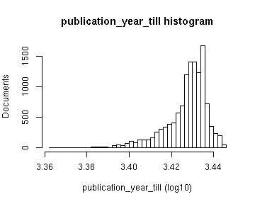

# Preprocessing summary

## Specific fields

  * [Author info](author.md)
  * [Gender info](gender.md)
  * [Publisher info](publisher.md)
  * [Publication geography](publicationplace.md)
  * [Publication year info](publicationyear.md)
  * [Titles](title.md)  
  * [Page counts](pagecount.md)
  * [Physical dimension](dimension.md)    
  * [Document and subject topics](topic.md)
  * [Languages](language.md)

## Field conversions

This documents the conversions from raw data to the final preprocessed version (accepted, discarded, conversions). Only some of the key tables are explicitly linked below. The complete list of all summary tables is [here](output.tables/).

## Annotated documents

  * 385771 documents in the original raw data
  * 20000 documents in the final preprocessed data (5.18%)

Fraction of documents with data:

Same in exact numbers: documents with available/missing entries, and number of unique entries for each field. Sorted by missing data:

|field name                     | missing (%)| available (%)| available (n)| unique (n)|
|:------------------------------|-----------:|-------------:|-------------:|----------:|
|volnumber                      |       100.0|           0.0|             0|          1|
|parts                          |       100.0|           0.0|             0|          1|
|note_granter                   |       100.0|           0.0|             0|          1|
|note_year                      |       100.0|           0.0|             0|          1|
|uncontrolled                   |       100.0|           0.0|             0|          1|
|holder                         |       100.0|           0.0|             0|          1|
|note_510c                      |       100.0|           0.0|             4|          5|
|width.original                 |        99.9|           0.1|            23|         14|
|note_source                    |        99.8|           0.2|            38|         38|
|physical_accomppanied          |        99.7|           0.3|            65|         55|
|successor                      |        99.5|           0.5|           107|        108|
|866x                           |        99.4|           0.6|           116|         32|
|volcount                       |        99.4|           0.6|           118|         14|
|publication_frequency          |        99.2|           0.8|           157|         32|
|772c                           |        99.1|           0.9|           174|        147|
|650y                           |        99.1|           1.0|           190|         90|
|publication_interval           |        98.7|           1.4|           270|        263|
|subject_geography              |        98.3|           1.7|           335|        230|
|first_edition                  |        97.9|           2.1|           417|          3|
|650x                           |        97.8|           2.2|           432|        211|
|height.original                |        97.8|           2.2|           435|         39|
|110a                           |        97.7|           2.3|           467|        432|
|title_uniform                  |        97.4|           2.6|           529|        466|
|publication_year_till          |        97.0|           3.0|           593|        202|
|772d                           |        96.7|           3.3|           659|        515|
|772t                           |        96.7|           3.3|           668|        542|
|650z                           |        96.1|           3.9|           789|        258|
|260e                           |        93.5|           6.5|          1290|        171|
|uncontrolled_title             |        91.6|           8.4|          1684|       1636|
|440v                           |        91.4|           8.6|          1725|        860|
|corporate                      |        91.2|           8.8|          1764|        575|
|700d                           |        90.0|          10.0|          1996|       1492|
|subject_topic                  |        89.0|          10.9|          2190|       1830|
|physical_details               |        87.6|          12.4|          2486|        107|
|440a                           |        85.8|          14.2|          2842|       2019|
|700a                           |        84.6|          15.4|          3072|       2652|
|paper                          |        84.3|          15.7|          3138|        684|
|obl                            |        83.2|          16.8|          3360|          3|
|260f                           |        82.0|          18.0|          3603|       1108|
|width                          |        81.0|          19.0|          3794|         31|
|height                         |        81.0|          19.0|          3794|         43|
|area                           |        81.0|          19.0|          3794|         58|
|self_published                 |        76.7|          23.3|          4655|          3|
|245c                           |        73.3|          26.7|          5333|       5096|
|976a                           |        72.8|          27.2|          5447|       3043|
|976b                           |        72.8|          27.2|          5447|       3118|
|publisher                      |        68.7|          31.4|          6270|       2658|
|900d                           |        67.2|          32.8|          6558|       3783|
|900a                           |        66.1|          33.9|          6784|       4195|
|900u                           |        66.1|          33.9|          6784|       4167|
|note_general                   |        65.6|          34.4|          6870|       5037|
|author_death                   |        58.6|          41.4|          8271|        399|
|title_remainder                |        56.7|          43.3|          8668|       7683|
|author_gender                  |        56.1|          43.9|          8772|          4|
|author_birth                   |        55.7|          44.3|          8861|        394|
|pagecount                      |        38.8|          61.2|         12248|        703|
|pagecount.orig                 |        38.8|          61.2|         12248|        703|
|852z                           |        37.5|          62.5|         12496|       1145|
|author_name                    |        27.2|          72.8|         14555|      10762|
|author                         |        27.2|          72.8|         14555|      10812|
|country                        |        12.0|          88.0|         17605|         30|
|852j                           |         8.8|          91.2|         18235|       9784|
|publication_place              |         4.3|          95.7|         19148|        600|
|publication_year_from          |         3.7|          96.3|         19266|        393|
|publication_year               |         3.7|          96.3|         19266|        393|
|publication_decade             |         3.7|          96.3|         19266|         51|
|language                       |         2.7|          97.3|         19467|         47|
|dissertation                   |         1.8|          98.2|         19637|          3|
|synodal                        |         1.8|          98.2|         19637|          2|
|latitude                       |         1.0|          99.0|         19795|        492|
|longitude                      |         1.0|          99.0|         19795|        492|
|title                          |         0.6|          99.4|         19874|      19279|
|language.Swedish               |         0.0|         100.0|         20000|          2|
|language.German                |         0.0|         100.0|         20000|          2|
|language.Latin                 |         0.0|         100.0|         20000|          2|
|language.French                |         0.0|         100.0|         20000|          2|
|language.English               |         0.0|         100.0|         20000|          2|
|language.Norwegian             |         0.0|         100.0|         20000|          2|
|language.Italian               |         0.0|         100.0|         20000|          2|
|language.Danish                |         0.0|         100.0|         20000|          2|
|language.Finnish               |         0.0|         100.0|         20000|          2|
|language.Polish                |         0.0|         100.0|         20000|          2|
|language.Old Norse             |         0.0|         100.0|         20000|          2|
|language.Icelandic             |         0.0|         100.0|         20000|          2|
|language.Spanish               |         0.0|         100.0|         20000|          2|
|language.Latvian               |         0.0|         100.0|         20000|          2|
|language.Hungarian             |         0.0|         100.0|         20000|          2|
|language.No linguistic content |         0.0|         100.0|         20000|          2|
|language.Dutch                 |         0.0|         100.0|         20000|          2|
|language.Japanese              |         0.0|         100.0|         20000|          2|
|language.Arabic                |         0.0|         100.0|         20000|          2|
|language.Russian               |         0.0|         100.0|         20000|          2|
|language.Turkish               |         0.0|         100.0|         20000|          2|
|language.Esperanto             |         0.0|         100.0|         20000|          2|
|language.Greek Ancient to 1453 |         0.0|         100.0|         20000|          2|
|language.Portuguese            |         0.0|         100.0|         20000|          2|
|language.Norwegian Nynorsk     |         0.0|         100.0|         20000|          2|
|language.Croatian              |         0.0|         100.0|         20000|          2|
|language.Ukrainian             |         0.0|         100.0|         20000|          2|
|language.Slovak                |         0.0|         100.0|         20000|          2|
|language.Czech                 |         0.0|         100.0|         20000|          2|
|language.Estonian              |         0.0|         100.0|         20000|          2|
|language.Bantu Other           |         0.0|         100.0|         20000|          2|
|language.Kalâtdlisut           |         0.0|         100.0|         20000|          2|
|language.Hebrew                |         0.0|         100.0|         20000|          2|
|language.Tigré                 |         0.0|         100.0|         20000|          2|
|language.Bulgarian             |         0.0|         100.0|         20000|          2|
|language.Sami                  |         0.0|         100.0|         20000|          2|
|language.Tigrinya              |         0.0|         100.0|         20000|          2|
|language.Kongo                 |         0.0|         100.0|         20000|          2|
|language.Lule Sami             |         0.0|         100.0|         20000|          2|
|language.Faroese               |         0.0|         100.0|         20000|          2|
|language.Chinese               |         0.0|         100.0|         20000|          2|
|language.Slovenian             |         0.0|         100.0|         20000|          2|
|language.Greek Modern 1453-    |         0.0|         100.0|         20000|          2|
|language.Low German            |         0.0|         100.0|         20000|          2|
|language.Swahili               |         0.0|         100.0|         20000|          2|
|multilingual                   |         0.0|         100.0|         20000|          2|
|gatherings.original            |         0.0|         100.0|         20000|         10|
|obl.original                   |         0.0|         100.0|         20000|          2|
|original_row                   |         0.0|         100.0|         20000|      20000|
|author_pseudonyme              |         0.0|         100.0|         20000|          2|
|gatherings                     |         0.0|         100.0|         20000|         10|
|singlevol                      |         0.0|         100.0|         20000|          2|
|multivol                       |         0.0|         100.0|         20000|          2|
|issue                          |         0.0|         100.0|         20000|          2|

## Histograms of all entries for numeric variables

## Histograms of the top entries for factor variables

Non-trivial factors with at least 2 levels are shown.

