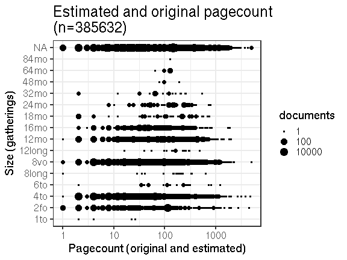
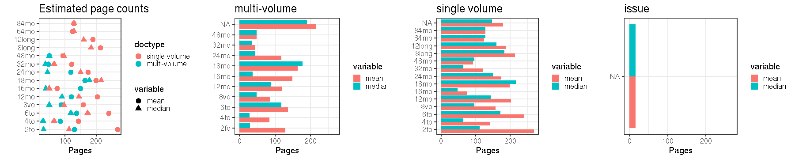

## Page counts

  * Page count missing and estimated for 56 documents (0.1%).

  * Page count missing and could not be estimated for 20464 documents (28%).

  * Page count updated for 0 documents.
  
  * [Conversions from raw data to final page count estimates](output.tables/pagecount_conversion_nontrivial.csv)

<!--[Page conversions from raw data to final page count estimates with volume info](output.tables/page_conversion_table_full.csv)-->

  * [Discarded pagecount info](output.tables/pagecount_discarded.csv) For these cases the missing/discarded page count was estimated based on average page count estimates for [single volume](mean_pagecounts_singlevol.csv), [multi-volume](mean_pagecounts_multivol.csv) and [issues](mean_pagecounts_issue.csv), calculated from those documents where original pagecount info is available.

  * [Automated tests for page count conversions](https://github.com/rOpenGov/bibliographica/blob/master/inst/extdata/tests_polish_physical_extent.csv)

Left: Gatherings vs. overall pagecounts (original + estimated). Right: Only the estimated page counts (shown only for the 56 documents that have missing pagecount info in the original data):

<!--

## Average page counts (only works in CERL now)

Multi-volume documents average page counts are given per volume.

|doc.dimension | mean.pages.singlevol|median.pages.singlevol | n.singlevol| mean.pages.multivol| median.pages.multivol| n.multivol| mean.pages.issue| median.pages.issue| n.issue|
|:-------------|--------------------:|:----------------------|-----------:|-------------------:|---------------------:|----------:|----------------:|------------------:|-------:|
|2fo           |                  NaN|NA                     |        1791|                  NA|                    NA|         NA|               NA|                 NA|      NA|
|4to           |                  NaN|NA                     |       30560|                  NA|                    NA|         NA|              NaN|                 NA|       5|
|6to           |                  NaN|NA                     |          18|                  NA|                    NA|         NA|              NaN|                 NA|       1|
|8long         |                  NaN|NA                     |           1|                  NA|                    NA|         NA|               NA|                 NA|      NA|
|8vo           |                  NaN|NA                     |       21437|                   1|                     1|         23|                1|                  1|       9|
|12mo          |                  NaN|NA                     |        2991|                 NaN|                    NA|          4|              NaN|                 NA|       1|
|16mo          |                  NaN|NA                     |        1296|                  NA|                    NA|         NA|               NA|                 NA|      NA|
|18mo          |                  NaN|NA                     |          86|                  NA|                    NA|         NA|               NA|                 NA|      NA|
|24mo          |                  NaN|NA                     |         163|                  NA|                    NA|         NA|               NA|                 NA|      NA|
|32mo          |                  NaN|NA                     |          30|                  NA|                    NA|         NA|               NA|                 NA|      NA|
|48mo          |                  NaN|NA                     |           7|                  NA|                    NA|         NA|               NA|                 NA|      NA|
|64mo          |                  NaN|NA                     |          32|                  NA|                    NA|         NA|               NA|                 NA|      NA|
|NA            |                  NaN|NA                     |       13482|                   1|                     1|         33|                1|                  1|      18|

-->
