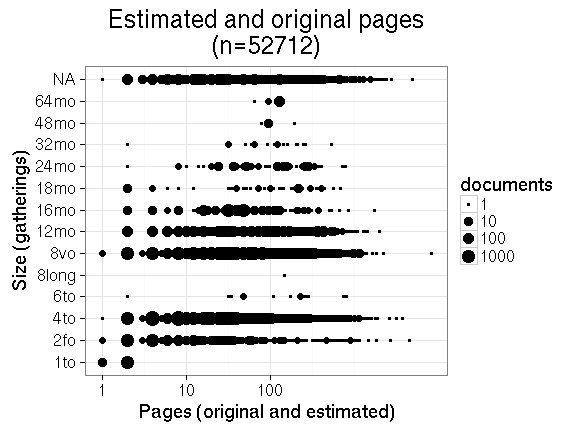
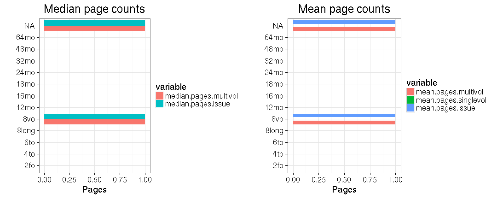

## Page counts

  * Page count missing and estimated for 2031 documents (0.5%).

<<<<<<< HEAD
  * Page count missing and could not be estimated for 147340 documents
=======
  * Page count missing and could not be estimated for 147340 documents (38.2%).
>>>>>>> 69bfdad43a36b485c65dca4bc57b7b2ed7a7c6ab

  * Page count updated for 0 documents.
  
  * [Conversions from raw data to final page count estimates](output.tables/pagecount_conversion_nontrivial.csv)

<!--[Page conversions from raw data to final page count estimates with volume info](output.tables/page_conversion_table_full.csv)-->

  * [Discarded pagecount info](output.tables/pagecount_discarded.csv) For these cases the missing/discarded page count was estimated based on average page count estimates for [single volume](mean_pagecounts_singlevol.csv), [multi-volume](mean_pagecounts_multivol.csv) and [issues](mean_pagecounts_issue.csv), calculated from those documents where original pagecount info is available.

  * [Automated tests for page count conversions](https://github.com/rOpenGov/bibliographica/blob/master/inst/extdata/tests_polish_physical_extent.csv)

Left: Gatherings vs. overall pagecounts (original + estimated). Right: Only the estimated page counts (shown only for the 2031 documents that have missing pagecount info in the original data):

<!--

## Average page counts (only works in CERL now)

Multi-volume documents average page counts are given per volume.

|doc.dimension |mean.pages.singlevol |median.pages.singlevol | n.singlevol| mean.pages.multivol| median.pages.multivol| n.multivol| mean.pages.issue| median.pages.issue| n.issue|
|:-------------|:--------------------|:----------------------|-----------:|-------------------:|---------------------:|----------:|----------------:|------------------:|-------:|
<<<<<<< HEAD
|2fo           |NA                   |NA                     |        1858|                  NA|                    NA|         NA|               NA|                 NA|      94|
|4to           |NA                   |NA                     |       32051|                  NA|                    NA|         NA|               NA|                 NA|   32064|
=======
|2fo           |NA                   |NA                     |        1858|                  NA|                    NA|         NA|               NA|                 NA|      NA|
|4to           |NA                   |NA                     |       32051|                  NA|                    NA|         NA|               NA|                 NA|       7|
>>>>>>> 69bfdad43a36b485c65dca4bc57b7b2ed7a7c6ab
|6to           |NA                   |NA                     |          28|                  NA|                    NA|         NA|               NA|                 NA|       1|
|8long         |NA                   |NA                     |          14|                  NA|                    NA|         NA|               NA|                 NA|      NA|
|8vo           |NA                   |NA                     |       25060|                   1|                     1|         95|                1|                  1|      30|
|12long        |NA                   |NA                     |           1|                  NA|                    NA|         NA|               NA|                 NA|      NA|
|12mo          |NA                   |NA                     |        3288|                 NaN|                    NA|         20|              NaN|                 NA|       3|
|16mo          |NA                   |NA                     |        1599|                 NaN|                    NA|          6|               NA|                 NA|      NA|
|18mo          |NA                   |NA                     |          95|                  NA|                    NA|         NA|               NA|                 NA|      NA|
|24mo          |NA                   |NA                     |         171|                  NA|                    NA|         NA|               NA|                 NA|      NA|
|32mo          |NA                   |NA                     |          32|                  NA|                    NA|         NA|               NA|                 NA|      NA|
|48mo          |NA                   |NA                     |           7|                  NA|                    NA|         NA|               NA|                 NA|      NA|
|64mo          |NA                   |NA                     |          35|                  NA|                    NA|         NA|               NA|                 NA|      NA|
|NA            |NA                   |NA                     |      318072|                   1|                     1|       1941|                1|                  1|    3596|
<<<<<<< HEAD
|1to           |NA                   |NA                     |          NA|                  NA|                    NA|         NA|               NA|                 NA|    1179|
=======
>>>>>>> 69bfdad43a36b485c65dca4bc57b7b2ed7a7c6ab

-->
