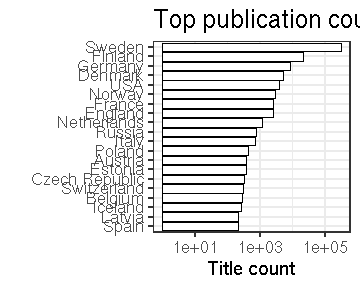

### Publication places

 * 2628 [publication places](output.tables/publication_place_accepted.csv); available for 369108 documents (96%). 
 * 38 [publication countries](output.tables/country_accepted.csv); available for 339223 documents (88%).
 * 99% of the documents could be matched to geographic coordinates (based on the [Geonames](http://download.geonames.org/export/dump/) database). See the [list of places missing geocoordinate information](output.tables/absentgeocoordinates.csv). Altogether ``1.03``% of the documents have missing geocoordinates.
 * [Places with unknown publication country](output.tables/publication_place_missingcountry.csv) (can be added to [country mappings](https://github.com/rOpenGov/bibliographica/blob/master/inst/extdata/reg2country.csv))
 * [Ambiguous publication places](output.tables/publication_place_ambiguous.csv)
 * [Potentially ambiguous region-country mappings](output.tables/publication_country_ambiguous.csv) (these may occur in the data in various synonymes and the country is not always clear when multiple countries have a similar place name; the default country is listed first)
 * [Conversions from the original to the accepted place names](output.tables/publication_place_conversion_nontrivial.csv)
 * [Unknown place names](output.tables/publication_place_todo.csv) These terms do not map to any known place on the [synonyme list](https://github.com/rOpenGov/bibliographica/blob/master/inst/extdata/PublicationPlaceSynonymes.csv); either because they require further cleaning or have not yet been encountered in the analyses
 * [Discarded place names](output.tables/publication_place_discarded.csv) These terms are potential place names but with a closer check explicitly rejected on the [synonyme list](https://github.com/rOpenGov/bibliographica/blob/master/inst/extdata/PublicationPlaceSynonymes.csv)
 * [Unit tests for place names](https://github.com/rOpenGov/bibliographica/blob/master/inst/extdata/tests_place.csv) are automatically checked during package build

Top-20 publication places are shown together with the number of documents.

### Top publication countries	

|Country | Documents (n)| Fraction (%)|
|:-------|-------------:|------------:|
|Sweden  |        286308|         74.2|
|Finland |         21285|          5.5|
|Germany |          8257|          2.1|
|Denmark |          5176|          1.3|
|USA     |          3787|          1.0|
|Norway  |          2999|          0.8|

