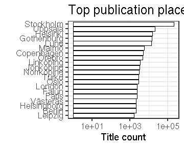

### Publication places

 * 2637 [unique publication places](output.tables/publication_place_accepted.csv); available for 369108 documents (96%).
 * 0 [ambiguous publication places](output.tables/publication_place_ambiguous.csv); some of these can be possibly resolved by checking that the the [synonyme list](https://github.com/COMHIS/bibliographica/blob/master/inst/extdata/PublicationPlaceSynonymes.csv) does not contain multiple versions of the final name (case sensitive). 
 * 2 [unknown place names](output.tables/publication_place_todo.csv) These terms do not map to any known place on the [synonyme list](https://github.com/COMHIS/bibliographica/blob/master/inst/extdata/PublicationPlaceSynonymes.csv); either because they require further cleaning or have not yet been encountered in the analyses. Terms that are clearly not place names can be added to [stopwords](inst/extdata/stopwords_for_place.csv); borderline cases that are not accepted as place names can be added as NA on the [synonyme list](https://github.com/COMHIS/bibliographica/blob/master/inst/extdata/PublicationPlaceSynonymes.csv).
 * 557 [discarded place names](output.tables/publication_place_discarded.csv) These terms are potential place names but with a closer check have been explicitly rejected on the [synonyme list](https://github.com/COMHIS/bibliographica/blob/master/inst/extdata/PublicationPlaceSynonymes.csv)
 * [Conversions from the original to the accepted place names](output.tables/publication_place_conversion_nontrivial.csv) 
 * [Unit tests for place names](https://github.com/COMHIS/bibliographica/blob/master/inst/extdata/tests_place.csv) are automatically checked during package build

Top-20 publication places are shown together with the number of documents.

### Publication countries	

 * 39 [unique publication countries](output.tables/publication_country_accepted.csv); available for 362962 documents (94%).
 * 1975 [places with unknown publication country](output.tables/publication_place_missingcountry.csv) (74.9% of the unique places; can be added to [country mappings](https://github.com/COMHIS/bibliographica/blob/master/inst/extdata/reg2country.csv))
 * 15 [potentially ambiguous region-country mappings](output.tables/publication_country_ambiguous.csv) (these may occur in the data in various synonymes and the country is not always clear when multiple countries have a similar place name; the default country is listed first). NOTE: possible improvements should not be done in this output summary but instead in the [country mapping file](https://github.com/COMHIS/bibliographica/blob/master/inst/extdata/reg2country.csv).

|Country | Documents (n)| Fraction (%)|
|:-------|-------------:|------------:|
|Sweden  |        310100|         80.4|
|Finland |         21310|          5.5|
|Germany |          8263|          2.1|
|Denmark |          5176|          1.3|
|USA     |          3786|          1.0|
|Norway  |          2999|          0.8|

### Geocoordinates

 * NaN% of the documents were matched to geographic coordinates (based on [Geonames](http://download.geonames.org/export/dump/)).
 * 0 unique places (0% of all unique places and NaN% of all documents) are missing geocoordinates. See [list of places missing geocoordinate information](output.tables/absentgeocoordinates.csv).
 

### Publication geography

 * 0 [unique countries](output.tables/publication_geography_country_accepted.csv) on geographical region considered in the publication; available for 0 documents (NaN%).
 * 0 [unique places](output.tables/publication_geography_place_accepted.csv) on geographical region considered in the publication; available for 0 documents (NaN%).

