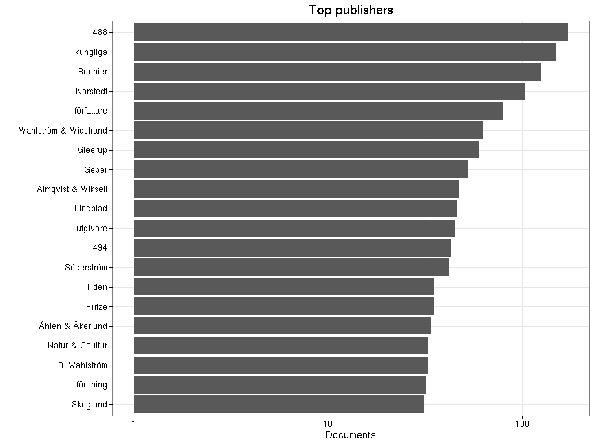
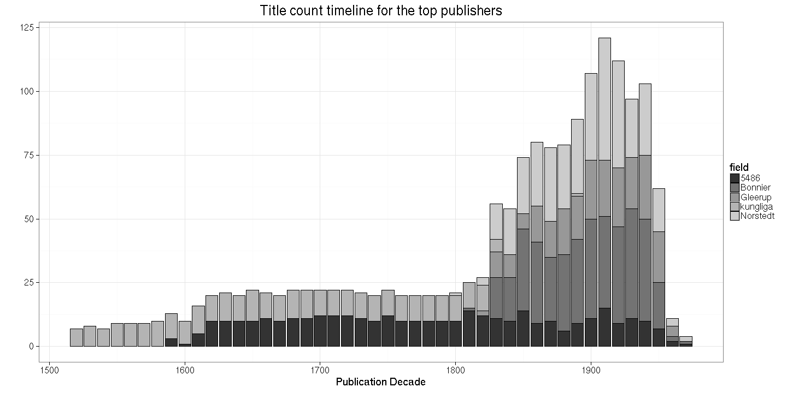
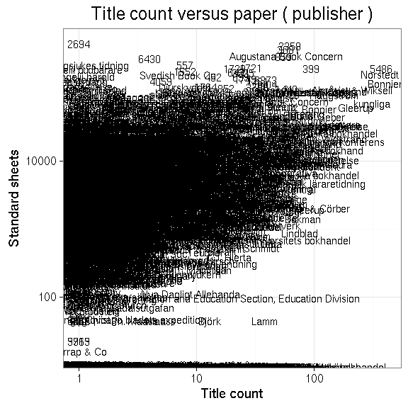

### Publishers

 * 17751 [unique publishers](output.tables/publisher_accepted.csv)

 * 133439 documents have unambiguous publisher information (35%). 

 * [Discarded publisher entries](output.tables/publisher_discarded.csv)

 * [Conversions from original to final names](output.tables/publisher_conversion_nontrivial.csv) (only non-trivial conversions shown)


The 20 most common publishers are shown with the number of documents. 



### Publication timeline for top publishers

Title count


```
## Warning: Removed 5 rows containing missing values (position_stack).
```




Title count versus paper consumption (top publishers):



|publisher           | titles|      paper|
|:-------------------|------:|----------:|
|norstedt            |   7251| 1772161.68|
|ahlen akerlund      |   2110|  249549.83|
|almqvist viksell    |   2073|  316506.60|
|b vahlström         |   1901|   15205.38|
|geber               |   2414|  290857.03|
|gleerup             |   2670|  232248.09|
|lindblad            |   2160|  173988.11|
|natur kultur        |   2313|  329256.34|
|tiden               |   1786|  180123.61|
|vahlström vidstrand |   3208|  388915.97|


