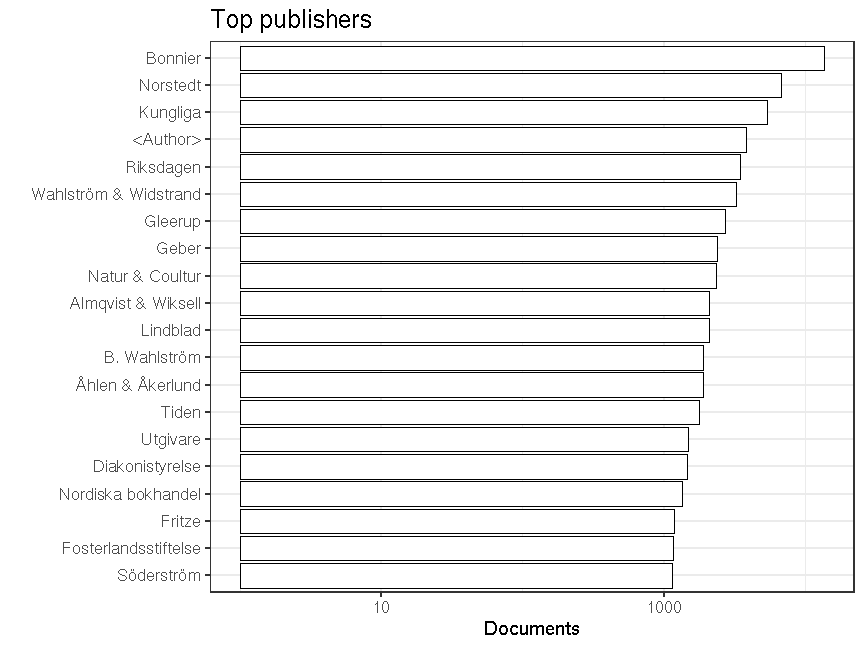

### Publishers

 * 16687 [unique publishers](output.tables/publisher_accepted.csv)

 * 166857 documents have unambiguous publisher information (43%). 

 * [Discarded publisher entries](output.tables/publisher_discarded.csv)

 * [Conversions from original to final names](output.tables/publisher_conversion_nontrivial.csv) (only non-trivial conversions shown)


The 20 most common publishers are shown with the number of documents. 



### Publication timeline for top publishers

Title count


```
## Warning: Removed 4 rows containing missing values (position_stack).
```


Title count versus paper consumption (top publishers):


|publisher             | titles|     paper|
|:---------------------|------:|---------:|
|<Author>              |   3848|  194712.7|
|Almqvist & Wiksell    |   2124|  330622.2|
|Bonnier               |  13636| 2327530.9|
|Geber                 |   2430|  290857.0|
|Gleerup               |   2701|  230833.0|
|Kungliga              |   5367| 1095709.6|
|Natur & Coultur       |   2324|  329256.3|
|Norstedt              |   6885| 1750031.8|
|Riksdagen             |   3453|       0.0|
|Wahlström & Widstrand |   3240|  407840.8|


