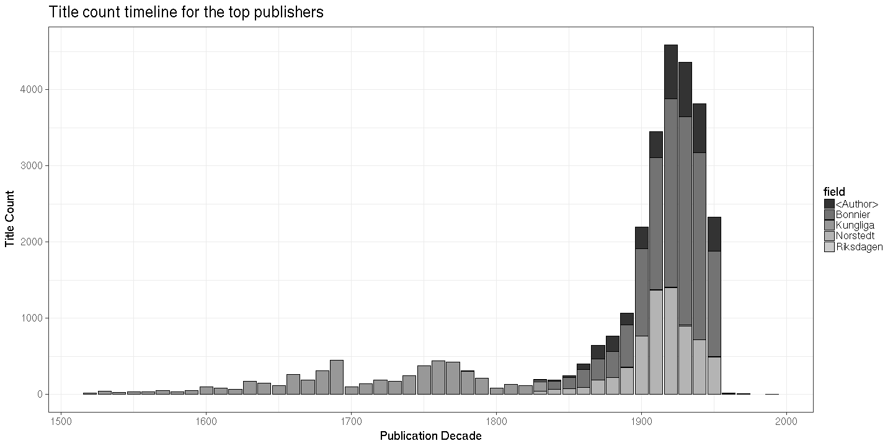

### Publishers

 * 20 [unique publishers](output.tables/publisher_accepted.csv)

 * 3800 documents have unambiguous publisher information (100%). 

 * [Discarded publisher entries](output.tables/publisher_discarded.csv)

 * [Conversions from original to final names](output.tables/publisher_conversion_nontrivial.csv) (only non-trivial conversions shown)

The 20 most common publishers are shown with the number of documents. 

### Publication timeline for top publishers

Title count

Title count versus paper consumption (top publishers):

|publisher               | titles|     paper|
|:-----------------------|------:|---------:|
|                        |   3774| 292084.68|
|kungl                   |      8|   3297.83|
|migneret desenne        |      1|      0.00|
|n vankijf               |      1|    106.94|
|nestler                 |      1|      0.00|
|pet momma               |      1|    234.38|
|pfeiffer                |      1|     42.88|
|redaktionen             |      1|      0.00|
|salvius                 |      1|    106.94|
|volfgang moritz endters |      1|      0.00|

