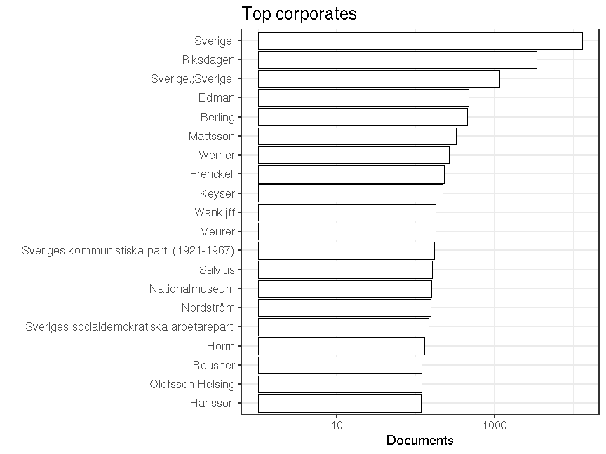

### Publishers

 * 16954 [unique publishers](output.tables/publisher_accepted.csv)

 * 166967 documents have unambiguous publisher information (43.3%). This includes documents identified as self-published; the author name is used as the publisher in those cases (if known).

 * 11 documents are identified as self-published (0%). 

 * [Discarded publisher entries](output.tables/publisher_discarded.csv)

 * [Conversions from original to final names](output.tables/publisher_conversion_nontrivial.csv) (only non-trivial conversions shown)

The 20 most common publishers are shown with the number of documents. 

### Publication timeline for top publishers

Title count

Title count versus paper consumption (top publishers):

|publisher             | titles|       paper|
|:---------------------|------:|-----------:|
|<Author>              |   3837|   190476.17|
|Almqvist & Wiksell    |   2094|   366913.72|
|Bonnier               |  13625|  2427276.04|
|Geber                 |   2369|   293880.21|
|Gleerup               |   2716|   236510.16|
|Kungliga              |   5367| 22618864.32|
|Natur & Coultur       |   2323|   346846.96|
|Norstedt              |   6706|  1905944.31|
|Riksdagen             |   3453|     2638.89|
|Wahlström & Widstrand |   3236|   435138.45|

### Corporates

Summaries of the corporate field.

 * 6474 [unique corporates](output.tables/corporate_accepted.csv)

 * 35002 documents have unambiguous corporate information (9.1%). 

 * [Discarded corporate entries](output.tables/corporate_discarded.csv)

 * [Conversions from original to final names](output.tables/corporate_conversion_nontrivial.csv) (only non-trivial conversions shown)

The 20 most common corporates are shown with the number of documents. 

