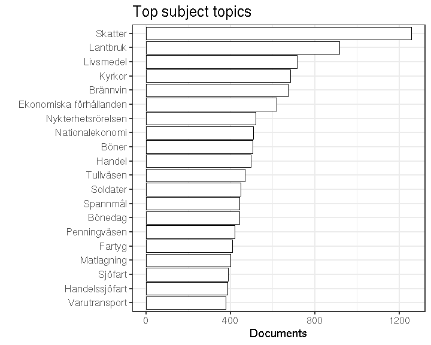
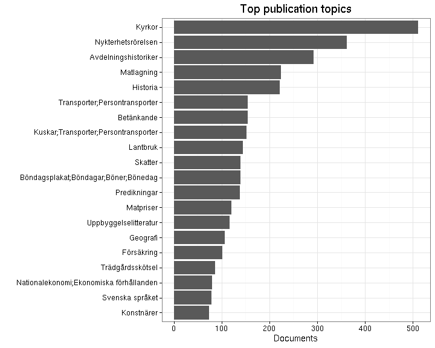

## Subject topics


  * 22254 [unique accepted subject topics](output.tables/subject_topic_accepted.csv)
  * [List of discarded subject topics](output.tables/subject_topic_discarded.csv)
  * 42890 documents (11%) are assigned a subject topic 


Top-20 subject topics and number of documents for each.



### Publication topic

We also have the publication_topic field. The links are invalid if the lists are empty.


  * 0 [unique accepted publication topics](output.tables/publication_topic_accepted.csv)
  * [List of discarded publication topics](output.tables/publication_topic_discarded.csv)
  * 0 documents (NaN%) are assigned a publication topic 


Top-20 publication topics and number of documents for each.


```
## Error in dfs$names: $ operator is invalid for atomic vectors
```


